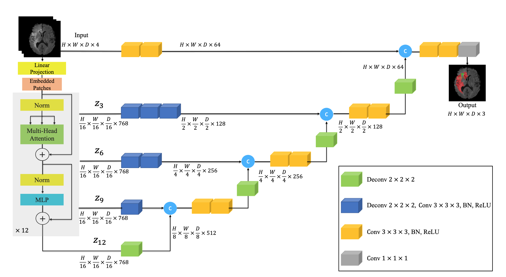

---
jupytext:
  formats: ipynb,md:myst
  text_representation:
    extension: .md
    format_name: myst
    format_version: 0.13
    jupytext_version: 1.15.2
kernelspec:
  display_name: Python 3 (ipykernel)
  language: python
  name: python3
---

# Image segmentation with a Vision Transformer and UNETR using JAX

[](https://colab.research.google.com/github/jax-ml/jax-ai-stack/blob/main/docs/source/JAX_examples_image_segmentation.ipynb)

This tutorial demonstrates how to implement and train a [UNETR](https://arxiv.org/abs/2103.10504) model for image segmentation using JAX, [Flax NNX](http://flax.readthedocs.io), and [Optax](http://optax.readthedocs.io) using the transformer encoder from the [Vision Transformer (ViT)](https://arxiv.org/abs/2010.11929). We will use [Orbax checkpoint manager](https://orbax.readthedocs.io/en/latest/api_reference/checkpoint.checkpoint_manager.html) to store best models during training.

The tutorial covers the preparation of the [Oxford Pets](https://www.robots.ox.ac.uk/%7Evgg/data/pets/) dataset, model implementation with Flax NNX, and training. The UNETR model utilizes a ViT transformer as the encoder to learn sequence representations of the input and capture the global multi-scale information, while also following the "U-shaped" network design, such as the [U-Net](https://arxiv.org/abs/1505.04597) model:



The image above shows the UNETR architecture for processing 3D inputs, but it can be adapted to 2D inputs.

By the end of this tutorial, you will learn how to:

- Prepare and preprocess the Oxford Pets dataset for image segmentation.
- Implement the UNETR model with a Vision Transformer encoder using Flax NNX.
- Train the model, evaluate its performance, and visualize predictions.

This tutorial assumes familiarity with JAX, Flax NNX, and basic deep learning and AI concepts. If you are new to JAX for AI, check out the [introductory tutorial](https://jax-ai-stack.readthedocs.io/en/latest/getting_started_with_jax_for_AI.html), which covers neural network building with [Flax NNX](https://flax.readthedocs.io/en/latest/nnx_basics.html).

+++

## Setup

JAX for AI (the stack) installation is covered [here](https://docs.jaxstack.ai/en/latest/install.html). And JAX (the library) installation is covered in [this guide](https://jax.readthedocs.io/en/latest/installation.html) on the JAX documentation site.

In addition, you will Orbax for checkpointing, as well as OpenCV and Pillow for reading images and masks from the [Oxford Pets dataset](https://www.robots.ox.ac.uk/%7Evgg/data/pets/) as NumPy arrays, [Albumentations](https://github.com/albumentations-team/albumentations) for data augmentations, and
[`grain`](https://github.com/google/grain/) for batched data loading. (Alternatively, you could also use  [tensorflow_dataset](https://www.tensorflow.org/datasets) or [torchvision](https://pytorch.org/vision/stable/index.html) for the same task.)

```{code-cell} ipython3
!pip install -U opencv-python-headless grain albumentations Pillow
!pip install -U flax optax orbax-checkpoint
```

Importing JAX, JAX NumPy, Flax NNX, Optax, Orbax Checkpoint, OpenCV, Albumentations and other dependencies:

```{code-cell} ipython3
import jax
import flax
import optax
import orbax.checkpoint as ocp

from flax import nnx
import jax.numpy as jnp

import albumentations as A
from typing import Any
from pathlib import Path

import cv2
import numpy as np
from PIL import Image  # we'll read images with opencv and use Pillow as a fallback

from typing import Any, Callable
import grain.python as grain

print("Jax version:", jax.__version__)
print("Flax version:", flax.__version__)
print("Optax version:", optax.__version__)
print("Orbax version:", ocp.__version__)
```

## Loading and preprocessing the Oxford Pets dataset

+++

### Loading the dataset

Let's download the Oxford Pets dataset and extract images and masks:

```{code-cell} ipython3
!rm -rf /tmp/data/oxford_pets
!mkdir -p /tmp/data/oxford_pets
!wget https://thor.robots.ox.ac.uk/datasets/pets/images.tar.gz -O /tmp/data/oxford_pets/images.tar.gz
!wget https://thor.robots.ox.ac.uk/datasets/pets/annotations.tar.gz -O /tmp/data/oxford_pets/annotations.tar.gz

!cd /tmp/data/oxford_pets && tar -xf images.tar.gz
!cd /tmp/data/oxford_pets && tar -xf annotations.tar.gz
!ls /tmp/data/oxford_pets
```

We can inspect the `images` folder, listing a subset of these files:

```{code-cell} ipython3
!ls /tmp/data/oxford_pets/images | wc -l
!ls /tmp/data/oxford_pets/images | head
!ls /tmp/data/oxford_pets/annotations/trimaps | wc -l
!ls /tmp/data/oxford_pets/annotations/trimaps | head
```

### Splitting the dataset into training and validation sets

Next, we'll create the `OxfordPetsDataset` class providing access to our images and masks. The class implements `__len__` and `__getitem__` methods. In this example, we do not have a hard training and validation data split, so we will use the total dataset and make a random training/validation split by indices. For this purpose, we create a helper `SubsetDataset` class to map indices into training and validation (test) set parts.

```{code-cell} ipython3
class OxfordPetsDataset:
    def __init__(self, path: Path):
        assert path.exists(), path
        self.path: Path = path
        self.images = sorted((self.path / "images").glob("*.jpg"))
        self.masks = [
            self.path / "annotations" / "trimaps" / path.with_suffix(".png").name
            for path in self.images
        ]
        assert len(self.images) == len(self.masks), (len(self.images), len(self.masks))

    def __len__(self) -> int:
        return len(self.images)

    def read_image_opencv(self, path: Path):
        img = cv2.imread(str(path))
        if img is not None:
            return cv2.cvtColor(img, cv2.COLOR_BGR2RGB)
        else:
            None

    def read_image_pillow(self, path: Path):
        img = Image.open(str(path))
        img = img.convert("RGB")
        return np.asarray(img)

    def read_mask(self, path: Path):
        mask = cv2.imread(str(path), cv2.IMREAD_GRAYSCALE)
        # mask has values: 1, 2, 3
        # 1 - object mask
        # 2 - background
        # 3 - boundary
        # Define mask as 0-based int values
        mask = mask - 1
        return mask.astype("uint8")

    def __getitem__(self, index: int) -> dict[str, np.ndarray]:
        img_path, mask_path = self.images[index], self.masks[index]
        img = self.read_image_opencv(img_path)
        if img is None:
            # Fallback to Pillow if OpenCV fails to read an image
            img = self.read_image_pillow(img_path)
        mask = self.read_mask(mask_path)
        return {
            "image": img,
            "mask": mask,
        }


class SubsetDataset:
    def __init__(self, dataset, indices: list[int]):
        # Check input indices values:
        for i in indices:
            assert 0 <= i < len(dataset)
        self.dataset = dataset
        self.indices = indices

    def __len__(self) -> int:
        return len(self.indices)

    def __getitem__(self, index: int) -> Any:
        i = self.indices[index]
        return self.dataset[i]
```

Now, let's define the entire dataset and compute data indices for training and validation (test) splits:

```{code-cell} ipython3
seed = 12
train_split = 0.7
dataset_path = Path("/tmp/data/oxford_pets")

dataset = OxfordPetsDataset(dataset_path)

rng = np.random.default_rng(seed=seed)
le = len(dataset)
data_indices = list(range(le))

# Remove few indices corresponding to corrupted images
# to avoid libjpeg warnings during the data loading.
corrupted_data_indices = [3017, 3425]
for index in corrupted_data_indices:
    data_indices.remove(index)

random_indices = rng.permutation(data_indices)

train_val_split_index = int(train_split * le)
train_indices = random_indices[:train_val_split_index]
val_indices = random_indices[train_val_split_index:]

# Ensure there is no overlapping.
assert len(set(train_indices) & set(val_indices)) == 0

train_dataset = SubsetDataset(dataset, indices=train_indices)
val_dataset = SubsetDataset(dataset, indices=val_indices)

print("Training dataset size:", len(train_dataset))
print("Validation dataset size:", len(val_dataset))
```

Let's inspect the training and validation datasets by displaying images and masks:

```{code-cell} ipython3
import matplotlib.pyplot as plt


def display_datapoint(datapoint, label=""):
    img, mask = datapoint["image"], datapoint["mask"]
    if img.dtype in (np.float32, ):
        img = ((img - img.min()) / (img.max() - img.min()) * 255.0).astype(np.uint8)
    fig, axs = plt.subplots(1, 3, figsize=(10, 10))
    axs[0].set_title(f"Image{label}")
    axs[0].imshow(img)
    axs[1].set_title(f"Mask{label}")
    axs[1].imshow(mask)
    axs[2].set_title("Image + Mask")
    axs[2].imshow(img)
    axs[2].imshow(mask, alpha=0.5)


display_datapoint(train_dataset[0], label=" (train set)")
display_datapoint(val_dataset[0], label=" (val set)")
```

### Data augmentation

Data augmentation can be important for increasing the diversity of the dataset, which includes random rotations, resizing crops, horizontal flips, and brightness/contrast adjustments. In this section, we'll define a simple data augmentation pipeline of joined image and mask transformations using [Albumentations](https://albumentations.ai/docs/examples/example/), so that we can apply geometric and color transformations to increase the diversity of the training data. For more details on the Albumentations transformations, check the [Albumentations reference API](https://albumentations.ai/docs/api_reference/full_reference/).

```{code-cell} ipython3
img_size = 256

train_transforms = A.Compose([
    A.Affine(rotate=(-35, 35), cval_mask=1, p=0.3),  # Random rotations -35 to 35 degrees
    A.RandomResizedCrop(width=img_size, height=img_size, scale=(0.7, 1.0)),  # Crop a random part of the input and rescale it to a specified size
    A.HorizontalFlip(p=0.5),  # Horizontal random flip.
    A.RandomBrightnessContrast(p=0.4),  # Randomly changes the brightness and contrast.
    A.Normalize(),  # Normalize the image and cast to float
])


val_transforms = A.Compose([
    A.Resize(width=img_size, height=img_size),
    A.Normalize(),  # Normalize the image and cast to float
])
```

In the code above:

- `Affine`: Applies random rotations to augment the dataset.
- `RandomResizedCrop`: Crops a random part of the image and then rescales it.
- `HorizontalFlip`: Randomly flips images horizontally.
- `RandomBrightnessContrast`: Adjusts brightness and contrast to introduce variation to our data.
- `Normalize`: Normalizes the images.

Let's preview the dataset after transformations:

```{code-cell} ipython3
output = train_transforms(**train_dataset[0])
img, mask = output["image"], output["mask"]
print("Image array info:", img.dtype, img.shape, img.min(), img.mean(), img.max())
print("Mask array info:", mask.dtype, mask.shape, mask.min(), mask.max())
```

```{code-cell} ipython3
output = val_transforms(**val_dataset[0])
img, mask = output["image"], output["mask"]
print("Image array info:", img.dtype, img.shape, img.min(), img.mean(), img.max())
print("Mask array info:", mask.dtype, mask.shape, mask.min(), mask.max())
```

### Data loading with `grain.IndexSampler` and `grain.DataLoader`

Let's now use [`grain`](https://github.com/google/grain) to perform data loading, augmentations and batching on a single device using multiple workers. We will create a random index sampler for training and an unshuffled sampler for validation. Note that using multiple workers (`worker_count`) allows us to parallelize data transformations, speeding up the data loading process.

```{code-cell} ipython3
class DataAugs(grain.MapTransform):
    def __init__(self, transforms: Callable):
        self.albu_transforms = transforms

    def map(self, data):
        output = self.albu_transforms(**data)
        return output
```

```{code-cell} ipython3
train_batch_size = 72
val_batch_size = 2 * train_batch_size


# Create a `grin.IndexSampler` with no sharding for single-device computations.
train_sampler = grain.IndexSampler(
    len(train_dataset),  # The total number of samples in the data source.
    shuffle=True,            # Shuffle the data to randomize the order of samples.
    seed=seed,               # Set a seed for reproducibility.
    shard_options=grain.NoSharding(),  # No sharding since this is a single-device setup.
    num_epochs=1,            # Iterate over the dataset for one epoch.
)

val_sampler = grain.IndexSampler(
    len(val_dataset),  # The total number of samples in the data source.
    shuffle=False,         # Do not shuffle the data.
    seed=seed,             # Set a seed for reproducibility.
    shard_options=grain.NoSharding(),  # No sharding since this is a single-device setup.
    num_epochs=1,          # Iterate over the dataset for one epoch.
)
```

Using multiple workers (`worker_count=4`) allows for parallel processing of transformations, improving efficiency.

```{code-cell} ipython3
train_loader = grain.DataLoader(
    data_source=train_dataset,
    sampler=train_sampler,                 # A sampler to determine how to access the data.
    worker_count=4,                        # Number of child processes launched to parallelize the transformations along.
    worker_buffer_size=2,                  # Count the output batches to produce in advance, per each worker.
    operations=[
        DataAugs(train_transforms),
        grain.Batch(train_batch_size, drop_remainder=True),
    ]
)

# Validation dataset `grain.DataLoader`.
val_loader = grain.DataLoader(
    data_source=val_dataset,
    sampler=val_sampler,                   # Sampler to determine how to access the data
    worker_count=4,                        # Number of child processes launched to parallelize the transformations among
    worker_buffer_size=2,
    operations=[
        DataAugs(val_transforms),
        grain.Batch(val_batch_size),
    ]
)

# Training `grain.DataLoader` for evaluation (without data augmentation).
train_eval_loader = grain.DataLoader(
    data_source=train_dataset,
    sampler=train_sampler,                 # Sampler to determine how to access the data
    worker_count=4,                        # Number of child processes launched to parallelize the transformations among
    worker_buffer_size=2,                  # Count of output batches to produce in advance per worker
    operations=[
        DataAugs(val_transforms),
        grain.Batch(val_batch_size),
    ]
)
```

Split the training and validation sets into batches:

```{code-cell} ipython3
train_batch = next(iter(train_loader))
val_batch = next(iter(val_loader))
```

```{code-cell} ipython3
print("Training set images batch info:", type(train_batch["image"]), train_batch["image"].shape, train_batch["image"].dtype)
print("Training set masks batch info:", type(train_batch["mask"]), train_batch["mask"].shape, train_batch["mask"].dtype)
```

Display the training and validation data:

```{code-cell} ipython3
images, masks = train_batch["image"], train_batch["mask"]

for img, mask in zip(images[:3], masks[:3]):
    display_datapoint({"image": img, "mask": mask}, label=" (augmented train set)")
```

```{code-cell} ipython3
images, masks = val_batch["image"], val_batch["mask"]

for img, mask in zip(images[:3], masks[:3]):
    display_datapoint({"image": img, "mask": mask}, label=" (augmented validation set)")
```

## Implementing the UNETR architecture with the ViT encoder

In this section, we will implement the UNETR model from scratch using Flax NNX. The transformer encoder of UNETR is a Vision Transformer (ViT), as discussed in the beginning of this tutorial The feature maps returned by ViT have the same spatial size (`H / 16, W / 16`), and deconvolutions are used to upsample the feature maps, while the feature maps are upsampled and concatenated up to the original image size.

The reference PyTorch implementation of this model can be found on the [MONAI Library GitHub repository](https://github.com/Project-MONAI/MONAI/blob/dev/monai/networks/nets/unetr.py).

### The ViT encoder implementation

Here, we will implement the following modules of the ViT, based on the ViT paper (["An Image is Worth 16x16 Words: Transformers for Image Recognition at Scale"](https://arxiv.org/abs/2010.11929)):

- `PatchEmbeddingBlock`: The patch embedding block, which maps patches of pixels to a sequence of vectors.
- `MLPBlock`: The multilayer perceptron (MLP) block.
- `ViTEncoderBlock`: The ViT encoder block.

```{code-cell} ipython3
---
jupyter:
  source_hidden: true
---
class PatchEmbeddingBlock(nnx.Module):
    """
    A patch embedding block, based on the ViT paper.

    Args:
        in_channels (int): Number of input channels in the image (such as 3 for RGB).
        img_size (int): Input image size.
        patch_size (int): Size of the patches extracted from the image.
        hidden_size (int): Dimensionality of the embedding vectors.
        dropout_rate (int): Dropout rate (for regularization). Defaults to 0.0.
        rngs (flax.nnx.Rngs): A set of named `flax.nnx.RngStream` objects that generate a stream of JAX pseudo-random number generator (PRNG) keys. Defaults to `flax.nnx.Rngs(0)`.

    """
    def __init__(
        self,
        in_channels: int,  # Dimension of input channels.
        img_size: int,  # Dimension of input image.
        patch_size: int,  # Dimension of patch size.
        hidden_size: int,  # Dimension of hidden layer.
        dropout_rate: float = 0.0,
        *,
        rngs: nnx.Rngs = nnx.Rngs(0),
    ):
        n_patches = (img_size // patch_size) ** 2
        # The convolution to extract patch embeddings using `flax.nnx.Conv`.
        self.patch_embeddings = nnx.Conv(
            in_channels,
            hidden_size,
            kernel_size=(patch_size, patch_size),
            strides=(patch_size, patch_size),
            padding="VALID",
            use_bias=True,
            rngs=rngs,
        )

        # Positional embeddings for each patch using `flax.nnx.Param` and `jax.nn.initializers.truncated_normal`.
        initializer = jax.nn.initializers.truncated_normal(stddev=0.02)
        self.position_embeddings = nnx.Param(
            initializer(rngs.params(), (1, n_patches, hidden_size), jnp.float32)
        )
        # Dropout for regularization using `flax.nnx.Dropout`.
        self.dropout = nnx.Dropout(dropout_rate, rngs=rngs)

    def __call__(self, x: jax.Array) -> jax.Array:
        # Apply the convolution to extract patch embeddings.
        x = self.patch_embeddings(x)
        # Reshape for adding positional embeddings.
        x = x.reshape(x.shape[0], -1, x.shape[-1])
        # Add positional embeddings.
        embeddings = x + self.position_embeddings
        # Apply dropout for regularization.
        embeddings = self.dropout(embeddings)
        return embeddings


# Instantiate the patch embedding block.
mod = PatchEmbeddingBlock(3, 256, 16, 768, 0.5)
x = jnp.ones((4, 256, 256, 3))
y = mod(x)
print(y.shape)
```

```{code-cell} ipython3
---
jupyter:
  source_hidden: true
---
from typing import Callable


class MLPBlock(nnx.Sequential):
    """
    A multi-layer perceptron (MLP) block, inheriting from `flax.nnx.Module`.

    Args:
        hidden_size (int): Dimensionality of the hidden layer.
        mlp_dim (int): Dimension of the hidden layers in the feed-forward/MLP block.
        dropout_rate (int): Dropout rate (for regularization). Defaults to 0.0.
        activation_layer: Activation function. Defaults to `flax.nnx.gelu` (GeLU).
        rngs (flax.nnx.Rngs): A set of named `flax.nnx.RngStream` objects that generate a stream of JAX pseudo-random number generator (PRNG) keys. Defaults to `flax.nnx.Rngs(0)`.
    """
    def __init__(
        self,
        hidden_size: int,  # Dimension of hidden layer.
        mlp_dim: int,      # Dimension of feedforward layer
        dropout_rate: float = 0.0,
        activation_layer: Callable = nnx.gelu,
        *,
        rngs: nnx.Rngs = nnx.Rngs(0),
    ):
        layers = [
            nnx.Linear(hidden_size, mlp_dim, rngs=rngs),
            activation_layer,
            nnx.Dropout(dropout_rate, rngs=rngs),
            nnx.Linear(mlp_dim, hidden_size, rngs=rngs),
            nnx.Dropout(dropout_rate, rngs=rngs),
        ]
        super().__init__(*layers)

# Instantiate the MLP block.
mod = MLPBlock(768, 3072, 0.5)
x = jnp.ones((4, 256, 768))
y = mod(x)
print(y.shape)
```

```{code-cell} ipython3
---
jupyter:
  source_hidden: true
---
class ViTEncoderBlock(nnx.Module):
    """
    A ViT encoder block, inheriting from `flax.nnx.Module`.

    Args:
        hidden_size (int): Dimensionality of the hidden layer.
        mlp_dim (int): Dimension of the hidden layers in the feed-forward/MLP block.
        num_heads (int): Number of attention heads in each transformer layer.
        dropout_rate (int): Dropout rate (for regularization). Defaults to 0.0.
        rngs (flax.nnx.Rngs): A set of named `flax.nnx.RngStream` objects that generate a stream of JAX pseudo-random number generator (PRNG) keys. Defaults to `flax.nnx.Rngs(0)`.

    """
    def __init__(
        self,
        hidden_size: int,  # Dimension of hidden layer.
        mlp_dim: int,      # Dimension of feedforward layer.
        num_heads: int,    # Number of attention heads
        dropout_rate: float = 0.0,
        *,
        rngs: nnx.Rngs = nnx.Rngs(0),
    ) -> None:
        self.mlp = MLPBlock(hidden_size, mlp_dim, dropout_rate, rngs=rngs)
        self.norm1 = nnx.LayerNorm(hidden_size, rngs=rngs)
        self.attn = nnx.MultiHeadAttention(
            num_heads=num_heads,
            in_features=hidden_size,
            dropout_rate=dropout_rate,
            broadcast_dropout=False,
            decode=False,
            rngs=rngs,
        )
        self.norm2 = nnx.LayerNorm(hidden_size, rngs=rngs)

    def __call__(self, x: jax.Array) -> jax.Array:
        x = x + self.attn(self.norm1(x))
        x = x + self.mlp(self.norm2(x))
        return x

# Instantiate the ViT encoder block.
mod = ViTEncoderBlock(768, 3072, 12)
x = jnp.ones((4, 256, 768))
y = mod(x)
print(y.shape)
```

```{code-cell} ipython3
---
jupyter:
  source_hidden: true
---
class ViT(nnx.Module):
    """ Implements the ViT feature extractor, inheriting from `flax.nnx.Module`.

    Args:
        in_channels (int): Number of input channels in the image (such as 3 for RGB)..
        img_size (int): Input image size.
        patch_size (int): Size of the patches extracted from the image.
        hidden_size (int): Dimensionality of the embedding vectors. Defaults to 768.
        mlp_dim (int): Dimension of the hidden layers in the feed-forward/MLP block. Defaults to 3072.
        num_layers (int): Number of transformer encoder layers. Defaults to 12.
        num_heads (int): Number of attention heads in each transformer layer. Defaults to 12.
        dropout_rate (int): Dropout rate (for regularization). Defaults to 0.0.
        rngs (flax.nnx.Rngs): A set of named `flax.nnx.RngStream` objects that generate a stream of JAX pseudo-random number generator (PRNG) keys. Defaults to `flax.nnx.Rngs(0)`.
    """
    def __init__(
        self,
        in_channels: int,  # Dimension of input channels.
        img_size: int,  # Dimension of input image.
        patch_size: int,  # Dimension of patch size.
        hidden_size: int = 768,  # Dimension of hidden layer.
        mlp_dim: int = 3072,  # Dimension of feedforward layer.
        num_layers: int = 12,  # Number of transformer blocks.
        num_heads: int = 12,   # Number of attention heads.
        dropout_rate: float = 0.0,
        *,
        rngs: nnx.Rngs = nnx.Rngs(0),
    ):
        if hidden_size % num_heads != 0:
            raise ValueError("hidden_size should be divisible by num_heads.")

        self.patch_embedding = PatchEmbeddingBlock(
            in_channels=in_channels,
            img_size=img_size,
            patch_size=patch_size,
            hidden_size=hidden_size,
            dropout_rate=dropout_rate,
            rngs=rngs,
        )
        self.blocks = [
            ViTEncoderBlock(hidden_size, mlp_dim, num_heads, dropout_rate, rngs=rngs)
            for i in range(num_layers)
        ]
        self.norm = nnx.LayerNorm(hidden_size, rngs=rngs)

    def __call__(self, x: jax.Array) -> jax.Array:
        x = self.patch_embedding(x)
        hidden_states_out = []
        for blk in self.blocks:
            x = blk(x)
            hidden_states_out.append(x)
        x = self.norm(x)
        return x, hidden_states_out

# Instantiate the ViT feature extractor.
mod = ViT(3, 224, 16)
x = jnp.ones((4, 224, 224, 3))
y, hstates = mod(x)
print(y.shape, [s.shape for s in hstates])
```

At this point we implemented the encoder of the UNETR model. As we can see from the above output, ViT provides one encoded feature map and a list of intermediate feature maps. Three of them will be used in the decoding part.

+++

### UNETR blocks implementation

Now, we can implement remaining blocks and assemble them together in the UNETR implementation

Below, we will implement the following modules:
- `UNETR`
  - `UnetrBasicBlock`: creates the first skip connection from the input.
    - `UnetResBlock`
  - `UnetrPrUpBlock`: projection upsampling modules to create skip connections from the intermediate feature maps provided by ViT.
  - `UnetrUpBlock`: upsampling modules used in the decoder

```{code-cell} ipython3
---
jupyter:
  source_hidden: true
---
class Conv2dNormActivation(nnx.Sequential):
    def __init__(
        self,
        in_channels: int,
        out_channels: int,
        kernel_size: int = 3,
        stride: int = 1,
        padding: int | None = None,
        groups: int = 1,
        norm_layer: Callable[..., nnx.Module] = nnx.BatchNorm,
        activation_layer: Callable = nnx.relu,
        dilation: int = 1,
        bias: bool | None = None,
        rngs: nnx.Rngs = nnx.Rngs(0),
    ):
        self.out_channels = out_channels

        if padding is None:
            padding = (kernel_size - 1) // 2 * dilation
        if bias is None:
            bias = norm_layer is None

        # sequence integer pairs that give the padding to apply before
        # and after each spatial dimension
        padding = ((padding, padding), (padding, padding))

        layers = [
            nnx.Conv(
                in_channels,
                out_channels,
                kernel_size=(kernel_size, kernel_size),
                strides=(stride, stride),
                padding=padding,
                kernel_dilation=(dilation, dilation),
                feature_group_count=groups,
                use_bias=bias,
                rngs=rngs,
            )
        ]

        if norm_layer is not None:
            layers.append(norm_layer(out_channels, rngs=rngs))

        if activation_layer is not None:
            layers.append(activation_layer)

        super().__init__(*layers)
```

```{code-cell} ipython3
---
jupyter:
  source_hidden: true
---
class InstanceNorm(nnx.GroupNorm):
    def __init__(self, num_features, **kwargs):
        num_groups, group_size = num_features, None
        super().__init__(
            num_features,
            num_groups=num_groups,
            group_size=group_size,
            **kwargs,
        )


class UnetResBlock(nnx.Module):
    def __init__(
        self,
        in_channels: int,
        out_channels: int,
        kernel_size: int,
        stride: int,
        norm_layer: Callable[..., nnx.Module] = InstanceNorm,
        activation_layer: Callable = nnx.leaky_relu,
        *,
        rngs: nnx.Rngs = nnx.Rngs(0),
    ):
        self.conv_norm_act1 = Conv2dNormActivation(
            in_channels=in_channels,
            out_channels=out_channels,
            kernel_size=kernel_size,
            stride=stride,
            norm_layer=norm_layer,
            activation_layer=activation_layer,
            rngs=rngs,
        )
        self.conv_norm2 = Conv2dNormActivation(
            in_channels=out_channels,
            out_channels=out_channels,
            kernel_size=kernel_size,
            stride=1,
            norm_layer=norm_layer,
            activation_layer=None,
            rngs=rngs,
        )

        self.downsample = (in_channels != out_channels) or (stride != 1)
        if self.downsample:
            self.conv_norm3 = Conv2dNormActivation(
                in_channels=in_channels,
                out_channels=out_channels,
                kernel_size=1,
                stride=stride,
                norm_layer=norm_layer,
                activation_layer=None,
                rngs=rngs,
            )
        self.act = activation_layer

    def __call__(self, x: jax.Array) -> jax.Array:
        residual = x
        out = self.conv_norm_act1(x)
        out = self.conv_norm2(out)
        if self.downsample:
            residual = self.conv_norm3(residual)
        out += residual
        out = self.act(out)
        return out


mod = UnetResBlock(16, 32, 3, 1)
x = jnp.ones((4, 24, 24, 16))
y = mod(x)
print(y.shape)
```

```{code-cell} ipython3
---
jupyter:
  source_hidden: true
---
class UnetrBasicBlock(nnx.Module):
    def __init__(
        self,
        in_channels: int,
        out_channels: int,
        kernel_size: int,
        stride: int,
        norm_layer: Callable[..., nnx.Module] = InstanceNorm,
        *,
        rngs: nnx.Rngs = nnx.Rngs(0),
    ):
        self.layer = UnetResBlock(
            in_channels=in_channels,
            out_channels=out_channels,
            kernel_size=kernel_size,
            stride=stride,
            norm_layer=norm_layer,
        )

    def __call__(self, x: jax.Array) -> jax.Array:
        return self.layer(x)


mod = UnetrBasicBlock(16, 32, 3, 1)
x = jnp.ones((4, 24, 24, 16))
y = mod(x)
print(y.shape)
```

```{code-cell} ipython3
---
jupyter:
  source_hidden: true
---
class UnetrPrUpBlock(nnx.Module):
    """
    A projection upsampling module for UNETR: "Hatamizadeh et al.,
    UNETR: Transformers for 3D Medical Image Segmentation <https://arxiv.org/abs/2103.10504>"
    """

    def __init__(
        self,
        in_channels: int,  # number of input channels.
        out_channels: int, # number of output channels.
        num_layer: int,    # number of upsampling blocks.
        kernel_size: int,
        stride: int,
        upsample_kernel_size: int = 2,  # convolution kernel size for transposed convolution layers.
        norm_layer: Callable[..., nnx.Module] = InstanceNorm,
        *,
        rngs: nnx.Rngs = nnx.Rngs(0),
    ):
        upsample_stride = upsample_kernel_size
        self.transp_conv_init = nnx.ConvTranspose(
            in_features=in_channels,
            out_features=out_channels,
            kernel_size=(upsample_kernel_size, upsample_kernel_size),
            strides=(upsample_stride, upsample_stride),
            padding="VALID",
            rngs=rngs,
        )
        self.blocks = [
            nnx.Sequential(
                nnx.ConvTranspose(
                    in_features=out_channels,
                    out_features=out_channels,
                    kernel_size=(upsample_kernel_size, upsample_kernel_size),
                    strides=(upsample_stride, upsample_stride),
                    rngs=rngs,
                ),
                UnetResBlock(
                    in_channels=out_channels,
                    out_channels=out_channels,
                    kernel_size=kernel_size,
                    stride=stride,
                    norm_layer=norm_layer,
                    rngs=rngs,
                ),
            )
            for i in range(num_layer)
        ]

    def __call__(self, x: jax.Array) -> jax.Array:
        x = self.transp_conv_init(x)
        for blk in self.blocks:
            x = blk(x)
        return x


mod = UnetrPrUpBlock(16, 32, 2, 3, 1)
x = jnp.ones((4, 24, 24, 16))
y = mod(x)
print(y.shape)
```

```{code-cell} ipython3
---
jupyter:
  source_hidden: true
---
class UnetrUpBlock(nnx.Module):
    """
    An upsampling module for UNETR: "Hatamizadeh et al.,
    UNETR: Transformers for 3D Medical Image Segmentation <https://arxiv.org/abs/2103.10504>"
    """

    def __init__(
        self,
        in_channels: int,
        out_channels: int,
        kernel_size: int,
        upsample_kernel_size: int = 2,  # convolution kernel size for transposed convolution layers.
        norm_layer: Callable[..., nnx.Module] = InstanceNorm,
        *,
        rngs: nnx.Rngs = nnx.Rngs(0),
    ) -> None:
        upsample_stride = upsample_kernel_size
        self.transp_conv = nnx.ConvTranspose(
            in_features=in_channels,
            out_features=out_channels,
            kernel_size=(upsample_kernel_size, upsample_kernel_size),
            strides=(upsample_stride, upsample_stride),
            padding="VALID",
            rngs=rngs,
        )
        self.conv_block = UnetResBlock(
            out_channels + out_channels,
            out_channels,
            kernel_size=kernel_size,
            stride=1,
            norm_layer=norm_layer,
            rngs=rngs,
        )

    def __call__(self, x: jax.Array, skip: jax.Array) -> jax.Array:
        out = self.transp_conv(x)
        out = jnp.concat((out, skip), axis=-1)
        out = self.conv_block(out)
        return out


mod = UnetrUpBlock(16, 32, 3)
x = jnp.ones((4, 24, 24, 16))
skip = jnp.ones((4, 2 * 24, 2 * 24, 32))
y = mod(x, skip)
print(y.shape)
```

```{code-cell} ipython3
---
jupyter:
  source_hidden: true
---
class UNETR(nnx.Module):
    """UNETR model ported to NNX from MONAI implementation:
    - https://github.com/Project-MONAI/MONAI/blob/dev/monai/networks/nets/unetr.py
    """
    def __init__(
        self,
        out_channels: int,
        in_channels: int = 3,
        img_size: int = 256,
        feature_size: int = 16,
        hidden_size: int = 768,
        mlp_dim: int = 3072,
        num_heads: int = 12,
        dropout_rate: float = 0.0,
        norm_layer: Callable[..., nnx.Module] = InstanceNorm,
        *,
        rngs: nnx.Rngs = nnx.Rngs(0),
    ):
        if hidden_size % num_heads != 0:
            raise ValueError("hidden_size should be divisible by num_heads.")

        self.num_layers = 12
        self.patch_size = 16
        self.feat_size = img_size // self.patch_size
        self.hidden_size = hidden_size

        self.vit = ViT(
            in_channels=in_channels,
            img_size=img_size,
            patch_size=self.patch_size,
            hidden_size=hidden_size,
            mlp_dim=mlp_dim,
            num_layers=self.num_layers,
            num_heads=num_heads,
            dropout_rate=dropout_rate,
            rngs=rngs,
        )
        self.encoder1 = UnetrBasicBlock(
            in_channels=in_channels,
            out_channels=feature_size,
            kernel_size=3,
            stride=1,
            norm_layer=norm_layer,
            rngs=rngs,
        )
        self.encoder2 = UnetrPrUpBlock(
            in_channels=hidden_size,
            out_channels=feature_size * 2,
            num_layer=2,
            kernel_size=3,
            stride=1,
            upsample_kernel_size=2,
            norm_layer=norm_layer,
            rngs=rngs,
        )
        self.encoder3 = UnetrPrUpBlock(
            in_channels=hidden_size,
            out_channels=feature_size * 4,
            num_layer=1,
            kernel_size=3,
            stride=1,
            upsample_kernel_size=2,
            norm_layer=norm_layer,
            rngs=rngs,
        )
        self.encoder4 = UnetrPrUpBlock(
            in_channels=hidden_size,
            out_channels=feature_size * 8,
            num_layer=0,
            kernel_size=3,
            stride=1,
            upsample_kernel_size=2,
            norm_layer=norm_layer,
            rngs=rngs,
        )
        self.decoder5 = UnetrUpBlock(
            in_channels=hidden_size,
            out_channels=feature_size * 8,
            kernel_size=3,
            upsample_kernel_size=2,
            norm_layer=norm_layer,
            rngs=rngs,
        )
        self.decoder4 = UnetrUpBlock(
            in_channels=feature_size * 8,
            out_channels=feature_size * 4,
            kernel_size=3,
            upsample_kernel_size=2,
            norm_layer=norm_layer,
            rngs=rngs,
        )
        self.decoder3 = UnetrUpBlock(
            in_channels=feature_size * 4,
            out_channels=feature_size * 2,
            kernel_size=3,
            upsample_kernel_size=2,
            norm_layer=norm_layer,
            rngs=rngs,
        )
        self.decoder2 = UnetrUpBlock(
            in_channels=feature_size * 2,
            out_channels=feature_size,
            kernel_size=3,
            upsample_kernel_size=2,
            norm_layer=norm_layer,
            rngs=rngs,
        )

        self.out = nnx.Conv(
            in_features=feature_size,
            out_features=out_channels,
            kernel_size=(1, 1),
            strides=(1, 1),
            padding="VALID",
            use_bias=True,
            rngs=rngs,
        )

        self.proj_axes = (0, 1, 2, 3)
        self.proj_view_shape = [self.feat_size, self.feat_size, self.hidden_size]

    def proj_feat(self, x: jax.Array) -> jax.Array:
        new_view = [x.shape[0]] + self.proj_view_shape
        x = x.reshape(new_view)
        x = jnp.permute_dims(x, self.proj_axes)
        return x

    def __call__(self, x_in: jax.Array) -> jax.Array:
        x, hidden_states_out = self.vit(x_in)
        enc1 = self.encoder1(x_in)
        x2 = hidden_states_out[3]
        enc2 = self.encoder2(self.proj_feat(x2))
        x3 = hidden_states_out[6]
        enc3 = self.encoder3(self.proj_feat(x3))
        x4 = hidden_states_out[9]
        enc4 = self.encoder4(self.proj_feat(x4))
        dec4 = self.proj_feat(x)
        dec3 = self.decoder5(dec4, enc4)
        dec2 = self.decoder4(dec3, enc3)
        dec1 = self.decoder3(dec2, enc2)
        out = self.decoder2(dec1, enc1)
        return self.out(out)
```

```{code-cell} ipython3
# We'll use a different number of heads to make a smaller model
model = UNETR(out_channels=3, num_heads=4)
x = jnp.ones((4, 256, 256, 3))
y = model(x)
print(y.shape)
```

We can visualize and inspect the architecture on the implemented model using `nnx.display(model)`.

+++

## Train the model

In previous sections we defined training and validation dataloaders and the model. In this section we will train the model and define the loss function and the optimizer to perform the parameters optimization.

For the semantic segmentation task, we will define the loss function as a sum of Cross-Entropy and Jaccard loss functions. The Cross-Entropy loss function is a standard loss function for a multi-class classification tasks and the Jaccard loss function helps directly optimizing Intersection-over-Union measure for semantic segmentation.

```{code-cell} ipython3
import optax

num_epochs = 50
total_steps = len(train_dataset) // train_batch_size
learning_rate = 0.003
momentum = 0.9
```

```{code-cell} ipython3
lr_schedule = optax.linear_schedule(learning_rate, 0.0, num_epochs * total_steps)

iterate_subsample = np.linspace(0, num_epochs * total_steps, 100)
plt.plot(
    np.linspace(0, num_epochs, len(iterate_subsample)),
    [lr_schedule(i) for i in iterate_subsample],
    lw=3,
)
plt.title("Learning rate")
plt.xlabel("Epochs")
plt.ylabel("Learning rate")
plt.grid()
plt.xlim((0, num_epochs))
plt.show()


optimizer = nnx.ModelAndOptimizer(model, optax.adam(lr_schedule, momentum))
```

Let us implement the Jaccard loss, and then define the total loss combining the Cross-Entropy and Jaccard losses:

```{code-cell} ipython3
def compute_softmax_jaccard_loss(logits, masks, reduction="mean"):
    assert reduction in ("mean", "sum")
    y_pred = nnx.softmax(logits, axis=-1)
    b, c = y_pred.shape[0], y_pred.shape[-1]
    y = nnx.one_hot(masks, num_classes=c, axis=-1)

    y_pred = y_pred.reshape((b, -1, c))
    y = y.reshape((b, -1, c))

    intersection = y_pred * y
    union = y_pred + y - intersection + 1e-8

    intersection = jnp.sum(intersection, axis=1)
    union = jnp.sum(union, axis=1)

    if reduction == "mean":
        intersection = jnp.mean(intersection)
        union = jnp.mean(union)
    elif reduction == "sum":
        intersection = jnp.sum(intersection)
        union = jnp.sum(union)

    return 1.0 - intersection / union


def compute_losses_and_logits(model: nnx.Module, images: jax.Array, masks: jax.Array):
    logits = model(images)

    # Cross-Entropy loss.
    xentropy_loss = optax.softmax_cross_entropy_with_integer_labels(
        logits=logits, labels=masks
    ).mean()

    # Jaccard loss.
    jacc_loss = compute_softmax_jaccard_loss(logits=logits, masks=masks)

    # Total loss.
    loss = xentropy_loss + jacc_loss
    return loss, (xentropy_loss, jacc_loss, logits)
```

Now, we will implement a confusion matrix metric derived from [`flax.nnx.Metric`](https://flax.readthedocs.io/en/latest/api_reference/flax.nnx/training/metrics.html#flax.nnx.metrics.Metric). A confusion matrix will help us to compute the Intersection-Over-Union (IoU) metric per class and on average. Finally, we can also compute the accuracy metric using the confusion matrix.

```{code-cell} ipython3
class ConfusionMatrix(nnx.Metric):
    def __init__(
        self,
        num_classes: int,
        average: str | None = None,
    ):
        assert average in (None, "samples", "recall", "precision")
        assert num_classes > 0
        self.num_classes = num_classes
        self.average = average
        self.confusion_matrix = nnx.metrics.MetricState(
            jnp.zeros((self.num_classes, self.num_classes), dtype=jnp.int32)
        )
        self.count = nnx.metrics.MetricState(jnp.array(0, dtype=jnp.int32))

    def reset(self):
        self.confusion_matrix.value = jnp.zeros((self.num_classes, self.num_classes), dtype=jnp.int32)
        self.count.value = jnp.array(0, dtype=jnp.int32)

    def _check_shape(self, y_pred: jax.Array, y: jax.Array):
        if y_pred.shape[-1] != self.num_classes:
            raise ValueError(f"y_pred does not have correct number of classes: {y_pred.shape[-1]} vs {self.num_classes}")

        if not (y.ndim + 1 == y_pred.ndim):
            raise ValueError(
                f"y_pred must have shape (batch_size, num_classes (currently set to {self.num_classes}), ...) "
                "and y must have shape of (batch_size, ...), "
                f"but given {y.shape} vs {y_pred.shape}."
            )

    def update(self, **kwargs):
        # We assume that y.max() < self.num_classes and y.min() >= 0
        assert "y" in kwargs
        assert "y_pred" in kwargs
        y_pred = kwargs["y_pred"]
        y = kwargs["y"]
        self._check_shape(y_pred, y)
        self.count.value += y_pred.shape[0]

        y_pred = jnp.argmax(y_pred, axis=-1).ravel()
        y = y.ravel()
        indices = self.num_classes * y + y_pred
        matrix = jnp.bincount(indices, minlength=self.num_classes**2, length=self.num_classes**2)
        matrix = matrix.reshape((self.num_classes, self.num_classes))
        self.confusion_matrix.value += matrix

    def compute(self) -> jax.Array:
        if self.average:
            confusion_matrix = self.confusion_matrix.value.astype("float")
            if self.average == "samples":
                return confusion_matrix / self.count.value
            else:
                return self.normalize(self.confusion_matrix.value, self.average)
        return self.confusion_matrix.value

    @staticmethod
    def normalize(matrix: jax.Array, average: str) -> jax.Array:
        """Normalize given `matrix` with given `average`."""
        if average == "recall":
            return matrix / (jnp.expand_dims(matrix.sum(axis=1), axis=1) + 1e-15)
        elif average == "precision":
            return matrix / (matrix.sum(axis=0) + 1e-15)
        else:
            raise ValueError("Argument average should be one of 'samples', 'recall', 'precision'")


def compute_iou(cm: jax.Array) -> jax.Array:
    return jnp.diag(cm) / (cm.sum(axis=1) + cm.sum(axis=0) - jnp.diag(cm) + 1e-15)


def compute_mean_iou(cm: jax.Array) -> jax.Array:
    return compute_iou(cm).mean()


def compute_accuracy(cm: jax.Array) -> jax.Array:
    return jnp.diag(cm).sum() / (cm.sum() + 1e-15)
```

Next, let's define training and evaluation steps:

```{code-cell} ipython3
@nnx.jit
def train_step(
    model: nnx.Module, optimizer: nnx.Optimizer, batch: dict[str, np.ndarray]
):
    # Convert numpy arrays to jax.Array on GPU
    images = jnp.array(batch["image"])
    masks = jnp.array(batch["mask"], dtype=jnp.int32)

    grad_fn = nnx.value_and_grad(compute_losses_and_logits, has_aux=True)
    (loss, (xentropy_loss, jacc_loss, logits)), grads = grad_fn(model, images, masks)

    optimizer.update(grads)  # In-place updates.

    return loss, xentropy_loss, jacc_loss
```

```{code-cell} ipython3
@nnx.jit
def eval_step(
    model: nnx.Module, batch: dict[str, np.ndarray], eval_metrics: nnx.MultiMetric
):
    # Convert numpy arrays to jax.Array on GPU
    images = jnp.array(batch["image"])
    masks = jnp.array(batch["mask"], dtype=jnp.int32)
    loss, (_, _, logits) = compute_losses_and_logits(model, images, masks)

    eval_metrics.update(
        total_loss=loss,
        y_pred=logits,
        y=masks,
    )  # In-place updates.
```

Next, we'll define metrics for the evaluation phase: the total loss and the confusion matrix computed on training and validation datasets. And we'll also define helper objects to store the metrics history.

Metrics like IoU per class, mean IoU and accuracy will be calculated using the confusion matrix in the evaluation code.

```{code-cell} ipython3
eval_metrics = nnx.MultiMetric(
    total_loss=nnx.metrics.Average('total_loss'),
    confusion_matrix=ConfusionMatrix(num_classes=3),
)


eval_metrics_history = {
    "train_total_loss": [],
    "train_IoU": [],
    "train_mean_IoU": [],
    "train_accuracy": [],

    "val_total_loss": [],
    "val_IoU": [],
    "val_mean_IoU": [],
    "val_accuracy": [],
}
```

Let us define the training and evaluation logic. We define as well a checkpoint manager to store two best models defined by validation mean IoU metric value.

```{code-cell} ipython3
import time
import orbax.checkpoint as ocp


def train_one_epoch(epoch):
    start_time = time.time()

    model.train()  # Set model to the training mode: e.g. update batch statistics
    for step, batch in enumerate(train_loader):
        total_loss, xentropy_loss, jaccard_loss = train_step(model, optimizer, batch)

        print(
            f"\r[train] epoch: {epoch + 1}/{num_epochs}, iteration: {step}/{total_steps}, "
            f"total loss: {total_loss.item():.4f} ",
            f"xentropy loss: {xentropy_loss.item():.4f} ",
            f"jaccard loss: {jaccard_loss.item():.4f} ",
            end="")
        print("\r", end="")

    elapsed = time.time() - start_time
    print(
        f"\n[train] epoch: {epoch + 1}/{num_epochs}, elapsed time: {elapsed:.2f} seconds"
    )


def evaluate_model(epoch):
    start_time = time.time()

    # Compute the metrics on the train and val sets after each training epoch.
    model.eval()  # Set model to evaluation model: e.g. use stored batch statistics

    for tag, eval_loader in [("train", train_eval_loader), ("val", val_loader)]:
        eval_metrics.reset()  # Reset the eval metrics
        for val_batch in eval_loader:
            eval_step(model, val_batch, eval_metrics)

        for metric, value in eval_metrics.compute().items():
            if metric == "confusion_matrix":
                eval_metrics_history[f"{tag}_IoU"].append(
                    compute_iou(value)
                )
                eval_metrics_history[f"{tag}_mean_IoU"].append(
                    compute_mean_iou(value)
                )
                eval_metrics_history[f"{tag}_accuracy"].append(
                    compute_accuracy(value)
                )
            else:
                eval_metrics_history[f'{tag}_{metric}'].append(value)

        print(
            f"[{tag}] epoch: {epoch + 1}/{num_epochs} "
            f"\n - total loss: {eval_metrics_history[f'{tag}_total_loss'][-1]:0.4f} "
            f"\n - IoU per class: {eval_metrics_history[f'{tag}_IoU'][-1].tolist()} "
            f"\n - Mean IoU: {eval_metrics_history[f'{tag}_mean_IoU'][-1]:0.4f} "
            f"\n - Accuracy: {eval_metrics_history[f'{tag}_accuracy'][-1]:0.4f} "
            "\n"
        )

    elapsed = time.time() - start_time
    print(
        f"[evaluation] epoch: {epoch + 1}/{num_epochs}, elapsed time: {elapsed:.2f} seconds"
    )

    return eval_metrics_history['val_mean_IoU'][-1]


path = ocp.test_utils.erase_and_create_empty("/tmp/output-oxford-model/")
options = ocp.CheckpointManagerOptions(max_to_keep=2)
mngr = ocp.CheckpointManager(path, options=options)


def save_model(epoch):
    state = nnx.state(model)
    # We should convert PRNGKeyArray to the old format for Dropout layers
    # https://github.com/google/flax/issues/4231
    def get_key_data(x):
        if isinstance(x, jax._src.prng.PRNGKeyArray):
            if isinstance(x.dtype, jax._src.prng.KeyTy):
                return jax.random.key_data(x)
        return x

    serializable_state = jax.tree.map(get_key_data, state)
    mngr.save(epoch, args=ocp.args.StandardSave(serializable_state))
    mngr.wait_until_finished()
```

Now we can start the training. It can take around 45 minutes using a single GPU and use 19GB of GPU memory.

```{code-cell} ipython3
%%time

best_val_mean_iou = 0.0
for epoch in range(num_epochs):
    train_one_epoch(epoch)
    if (epoch % 3 == 0) or (epoch == num_epochs - 1):
        val_mean_iou = evaluate_model(epoch)
        if val_mean_iou > best_val_mean_iou:
            save_model(epoch)
            best_val_mean_iou = val_mean_iou
```

We can check the saved models:

```{code-cell} ipython3
!ls /tmp/output-oxford-model/
```

and visualize collected metrics:

```{code-cell} ipython3
epochs = [i for i in range(num_epochs) if (i % 3 == 0) or (i == num_epochs - 1)]

plt.plot(epochs, eval_metrics_history["train_total_loss"], label="Loss value on training set")
plt.plot(epochs, eval_metrics_history["val_total_loss"], label="Loss value on validation set")
plt.legend()
```

```{code-cell} ipython3
plt.plot(epochs, eval_metrics_history["train_mean_IoU"], label="Mean IoU on training set")
plt.plot(epochs, eval_metrics_history["val_mean_IoU"], label="Mean IoU on validation set")
plt.legend()
```

Next, we will visualize model predictions on validation data:

```{code-cell} ipython3
model.eval()
val_batch = next(iter(val_loader))
```

```{code-cell} ipython3
images, masks = val_batch["image"], val_batch["mask"]
preds = model(images)
preds = jnp.argmax(preds, axis=-1)
```

```{code-cell} ipython3
def display_image_mask_pred(img, mask, pred, label=""):
    if img.dtype in (np.float32, ):
        img = ((img - img.min()) / (img.max() - img.min()) * 255.0).astype(np.uint8)
    fig, axs = plt.subplots(1, 5, figsize=(15, 10))
    axs[0].set_title(f"Image{label}")
    axs[0].imshow(img)
    axs[1].set_title(f"Mask{label}")
    axs[1].imshow(mask)
    axs[2].set_title("Image + Mask")
    axs[2].imshow(img)
    axs[2].imshow(mask, alpha=0.5)
    axs[3].set_title(f"Pred{label}")
    axs[3].imshow(pred)
    axs[4].set_title("Image + Pred")
    axs[4].imshow(img)
    axs[4].imshow(pred, alpha=0.5)
```

```{code-cell} ipython3
for img, mask, pred in zip(images[:4], masks[:4], preds[:4]):
    display_image_mask_pred(img, mask, pred, label=" (validation set)")
```

We can see that model can roughly predict the shape of the animal and the background and struggles with predicting the boundary. Carefully choosing hyperparameters we may achieve better results.
