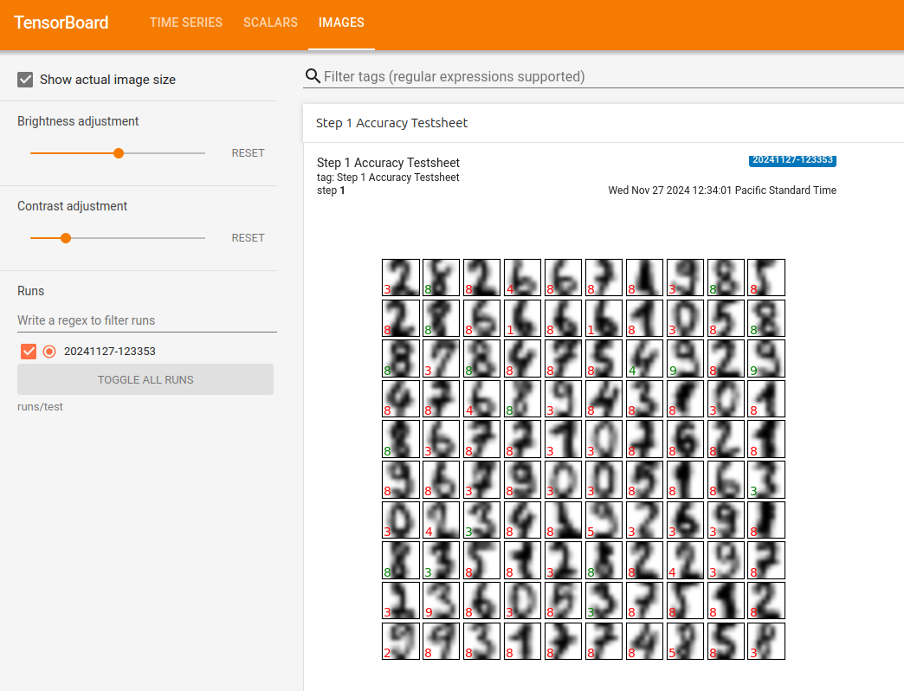
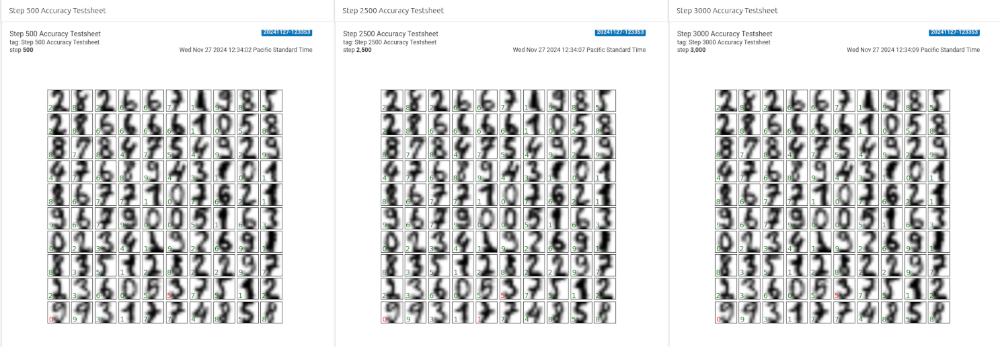

---
jupytext:
  formats: ipynb,md:myst
  text_representation:
    extension: .md
    format_name: myst
    format_version: 0.13
    jupytext_version: 1.16.6
kernelspec:
  display_name: jax-ai-stack
  language: python
  name: python3
---

# Visualize JAX model metrics with TensorBoard

[](https://colab.research.google.com/github/jax-ml/jax-ai-stack/blob/main/docs/source/JAX_visualizing_models_metrics.ipynb)

+++

Measuring and visualizing experiment metrics is an essential part of the machine learning workflow.
In this tutorial, we will measure a JAX model using [TensorBoard](https://www.tensorflow.org/tensorboard) - a visualization tool that allows tracking loss and accuracy, visualizing model graphs, and more.

We'll measure the model defined in [Getting started with JAX for AI](https://jax-ai-stack.readthedocs.io/en/latest/getting_started_with_jax_for_AI.html). Go through that tutorial before continuing because we'll use the same modeling and training code, and add TensorBoard connections to it.

## Setup

TensorBoard is a part of the TensorFlow library. We'll install TensorFlow, load the TensorBoard extension for use within Jupyter Notebooks, and import the required libraries.

```{code-cell} ipython3
# python -m pip install tensorflow-cpu
```

```{code-cell} ipython3
%load_ext tensorboard
```

```{code-cell} ipython3
import tensorflow as tf
import io
from datetime import datetime
```

In TensorFlow, a `SummaryWriter` object handles outputs and logs. Let's create this object using [`tf.summary.create_file_writer`](https://www.tensorflow.org/api_docs/python/tf/summary/create_file_writer) and set the directory where the outputs should be stored. The following organization structure is arbitrary, but keeping a folder for each training run can make future navigation more straightforward.

```{code-cell} ipython3
# Optional - Clear any logs from previous runs
# !rm -rf ./runs/test/
```

```{code-cell} ipython3
file_path = "runs/test/" + datetime.now().strftime("%Y%m%d-%H%M%S")
test_summary_writer = tf.summary.create_file_writer(file_path)
```

## Load the dataset

In the [Getting Started tutorial](https://docs.jaxstack.ai/en/latest/getting_started_with_jax_for_AI.html), we loaded the  scikit-learn digits dataset and used matplotlib to display a few images in the notebook.

We can also stash these images in TensorBoard. If a training needs to be repeated, it's more space efficient to stash the training data information and skip this step for subsequent trainings, provided the input is static.

```{code-cell} ipython3
:id: hKhPLnNxfOHU
:outputId: ac3508f0-ccc6-409b-c719-99a4b8f94bd6

from sklearn.datasets import load_digits
digits = load_digits()
```

Taken from the [TensorBoard example on displaying image data](https://www.tensorflow.org/tensorboard/image_summaries), the following convert function makes it easier to view matplotlib figures (which are in images) directly in TensorBoard.

```{code-cell} ipython3
# Source: https://www.tensorflow.org/tensorboard/image_summaries#logging_arbitrary_image_data
def plot_to_image(figure):
  """
  Converts the matplotlib plot specified by 'figure' to a PNG image and
  returns it. The supplied figure is closed and inaccessible after this call.
  """
  # Save the plot to a PNG in memory.
  buf = io.BytesIO()
  plt.savefig(buf, format='png')
  # Closing the figure prevents it from being displayed directly inside
  # the notebook.
  plt.close(figure)
  buf.seek(0)
  # Convert PNG buffer to TF image
  image = tf.image.decode_png(buf.getvalue(), channels=4)
  # Add the batch dimension
  image = tf.expand_dims(image, 0)
  return image
```

We'll use the `SummaryWriter` in a `with` context manager, to step in and out of this type of context through the run.

[tf.summary](https://www.tensorflow.org/api_docs/python/tf/summary) has several functions to log different types of information. Here, use [`tf.summary.image`](https://www.tensorflow.org/api_docs/python/tf/summary/image) to write the image.

```{code-cell} ipython3
:id: Y8cMntSdfyyT
:outputId: 9343a558-cd8c-473c-c109-aa8015c7ae7e

import matplotlib.pyplot as plt

fig, axes = plt.subplots(10, 10, figsize=(6, 6),
                         subplot_kw={'xticks':[], 'yticks':[]},
                         gridspec_kw=dict(hspace=0.1, wspace=0.1))

for i, ax in enumerate(axes.flat):
    ax.imshow(digits.images[i], cmap='binary', interpolation='gaussian')
    ax.text(0.05, 0.05, str(digits.target[i]), transform=ax.transAxes, color='green')

with test_summary_writer.as_default():
    tf.summary.image("Training Data", plot_to_image(fig), step=0)
```

We can now launch TensorBoard within the notebook. Notice the stored training data image.

```{code-cell} ipython3
%tensorboard --logdir runs/test
```

## Define and train the model

+++

We can now create a simple neural network using Flax.

```{code-cell} ipython3
:id: 6jrYisoPh6TL

from sklearn.model_selection import train_test_split
import jax.numpy as jnp
from flax import nnx

splits = train_test_split(digits.images, digits.target, random_state=0)

images_train, images_test, label_train, label_test = map(jnp.asarray, splits)
print(f"{images_train.shape=} {label_train.shape=}")
print(f"{images_test.shape=}  {label_test.shape=}")

class SimpleNN(nnx.Module):

  def __init__(self, n_features: int = 64, n_hidden: int = 100, n_targets: int = 10,
               *, rngs: nnx.Rngs):
    self.n_features = n_features
    self.layer1 = nnx.Linear(n_features, n_hidden, rngs=rngs)
    self.layer2 = nnx.Linear(n_hidden, n_hidden, rngs=rngs)
    self.layer3 = nnx.Linear(n_hidden, n_targets, rngs=rngs)

  def __call__(self, x):
    x = x.reshape(x.shape[0], self.n_features) # Flatten images.
    x = nnx.selu(self.layer1(x))
    x = nnx.selu(self.layer2(x))
    x = self.layer3(x)
    return x

model = SimpleNN(rngs=nnx.Rngs(0))

nnx.display(model)  # Interactive display if penzai is installed.
```

To track loss across our training run, we'll calculate loss in the training step.

Note that in the [Getting Started tutorial](https://docs.jaxstack.ai/en/latest/getting_started_with_jax_for_AI.html), this metric was computed once at the end of training, and called within the `for` loop.

```{code-cell} ipython3
:id: QwRvFPkYl5b2

import jax
import optax

optimizer = nnx.Optimizer(model, optax.sgd(learning_rate=0.05))

def loss_fun(
    model: nnx.Module,
    data: jax.Array,
    labels: jax.Array):
    logits = model(data)
    loss = optax.softmax_cross_entropy_with_integer_labels(
        logits=logits, labels=labels
    ).mean()
    return loss, logits

@nnx.jit  # JIT-compile the function
def train_step(
    model: nnx.Module,
    optimizer: nnx.Optimizer,
    data: jax.Array,
    labels: jax.Array):
    loss_gradient = nnx.grad(loss_fun, has_aux=True)  # gradient transform!
    grads, logits = loss_gradient(model, data, labels)
    optimizer.update(grads)  # inplace update

    # Calculate loss
    loss, _ = loss_fun(model, images_test, label_test)
    return loss
```

With the summary writer context in place, we can write the following to TensorBoard:
- the `Loss` scalar every epoch,
- model accuracy every 10 epochs
- accuracy test sheet every 500 epochs
 
Any custom metric can be added this through the `tf.summary` API.

```{code-cell} ipython3
:id: l9mukT0eqmsr
:outputId: c6c7b2d6-8706-4bc3-d5a6-0396d7cfbf56

max_epoch = 3000
with test_summary_writer.as_default():
    for i in range(max_epoch):
        loss = train_step(model, optimizer, images_train, label_train)
        ## Store the training loss per epoch
        tf.summary.scalar('Loss', loss.item(), step=i+1) #.item() because the loss coming out of train_step() is a tensor
        if ((i+1)%10 == 0) or i == 0:
            label_pred = model(images_test).argmax(axis=1)
            num_matches = jnp.count_nonzero(label_pred == label_test)
            num_total = len(label_test)
            accuracy = num_matches / num_total
            ## store the evaluated Accuracy every 10 epochs
            tf.summary.scalar('Accuracy', accuracy.item(), step=i+1)
        if ((i+1)%500 == 0) or i == 0:
            fig, axes = None, None
            fig, axes = plt.subplots(10, 10, figsize=(6, 6),
                         subplot_kw={'xticks':[], 'yticks':[]},
                         gridspec_kw=dict(hspace=0.1, wspace=0.1))

            label_pred = model(images_test).argmax(axis=1)

            for j, ax in enumerate(axes.flat):
                ax.imshow(images_test[j], cmap='binary', interpolation='gaussian')
                color = 'green' if label_pred[j] == label_test[j] else 'red'
                ax.text(0.05, 0.05, str(label_pred[j]), transform=ax.transAxes, color=color)
            ## store the Accuracy test sheet every 500 epochs - be sure to give each a different name, or they will overwrite the previous output.
            tf.summary.image(f"Step {i+1} Accuracy Testsheet", plot_to_image(fig), step=i+1)
```

## View metrics on TensorBoard

+++

On TensorBoard UI, the added `Loss` and `Accuracy` metrics are available in the `Scalars` tab under the `runs/test/` folder created dynamically using datetime.

```{code-cell} ipython3
%tensorboard --logdir runs/test
```

Since we've stored the example test sheet every 500 epochs, we can go back and step through the progress. With each training step using all of the training data, the steps and epochs are essentially the same here.

Navigate to the `Images` tab. 

At step 1, we see poor accuracy, as expected:



By 500, the model is essentially done. However, in the bottom row `7` gets lost and recovered at higher epochs as we go far into an overfitting regime. This kind of stored data can be very useful when the training routines become automated, and a human is potentially only checking when something has gone wrong.



+++

## Visualize model output

+++

In addition to the TensorBoard visualization, Flax [`nnx.display`](https://flax.readthedocs.io/en/latest/api_reference/flax.nnx/visualization.html#flax.nnx.display)'s interactive visualizations of networks and model outputs are also helpful. 
 
We can feed the top 35 test images into the model and display the final output vector for each. In the following plot, each row is an individual image prediction result, and each column corresponds to a class, in this case the digits (0-9).

```{code-cell} ipython3
nnx.display(model(images_test[:35]))
```

The highest value in a given row is the class prediction (`.argmax(axis=1)`). The following plot shows image predictions matching the largest value in each row in the previous(above) plot.

```{code-cell} ipython3
nnx.display(model(images_test[:35]).argmax(axis=1))
```

For more information about these tools, check out the [TensorBoard documentation](https://www.tensorflow.org/tensorboard/get_started) and [Treescope documentation ](https://treescope.readthedocs.io/en/stable/) (library behind `nnx.display`).

+++
