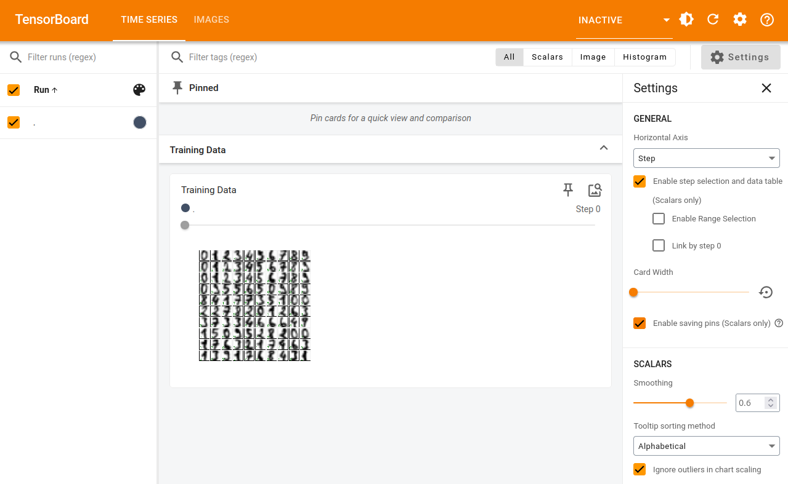
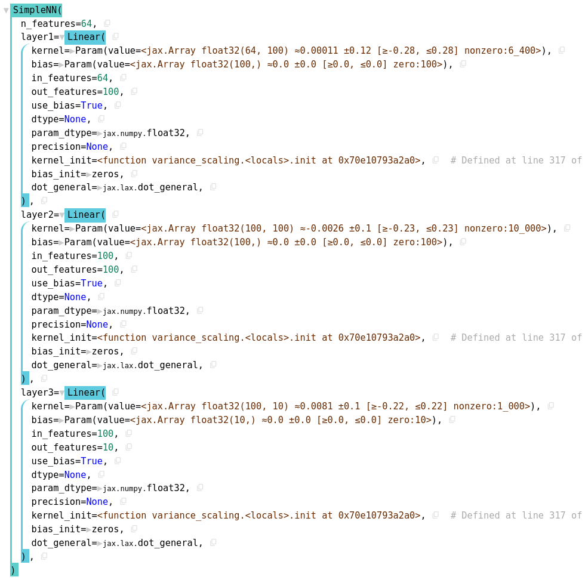
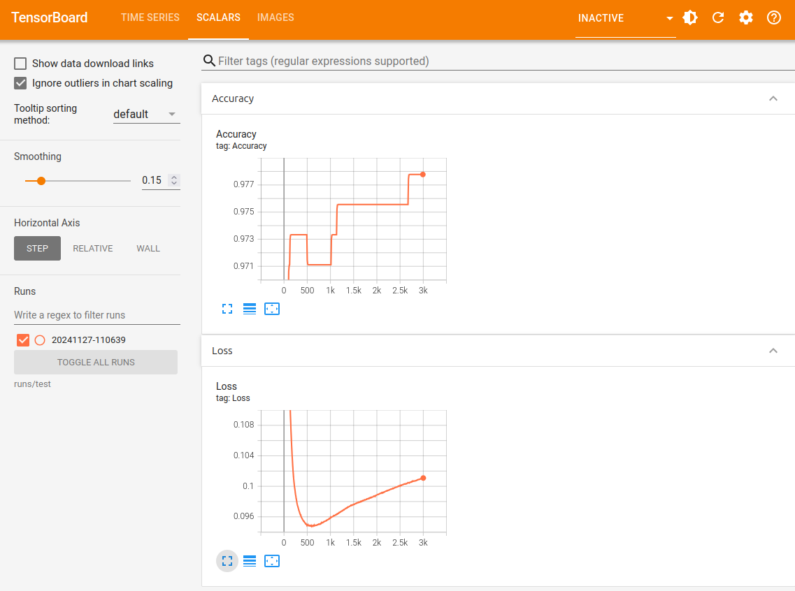
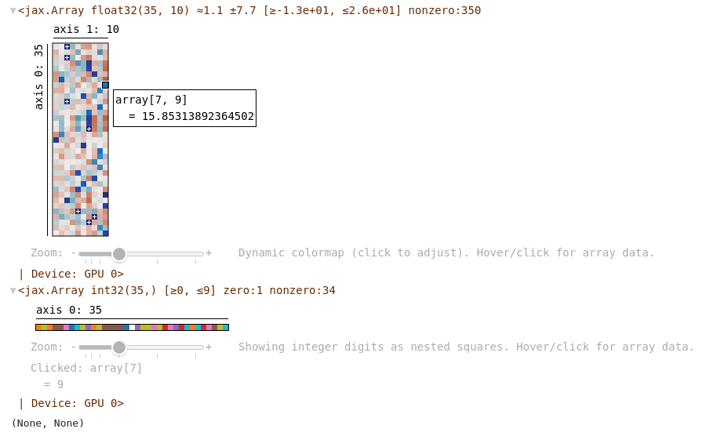

---
jupytext:
  formats: ipynb,md:myst
  text_representation:
    extension: .md
    format_name: myst
    format_version: 0.13
    jupytext_version: 1.15.2
kernelspec:
  display_name: Python 3 (ipykernel)
  language: python
  name: python3
---

# JAX and Tensorboard / NNX Display

[](https://colab.research.google.com/github/jax-ml/jax-ai-stack/blob/main/docs/source/JAX_visualizing_models_metrics.ipynb)

+++

To keep things straightforward and familiar, we reuse the model and data from [Getting started with JAX for AI](https://jax-ai-stack.readthedocs.io/en/latest/getting_started_with_jax_for_AI.html) - if you haven't read that yet and want the primer, start there before returning.

All of the modeling and training code is the same here. What we have added are the tensorboard connections and the discussion around them.

```{code-cell} ipython3
import tensorflow as tf
import io
from datetime import datetime
```

```{code-cell} ipython3
:id: hKhPLnNxfOHU
:outputId: ac3508f0-ccc6-409b-c719-99a4b8f94bd6

from sklearn.datasets import load_digits
digits = load_digits()
```

Here we set the location of the tensorflow writer - the organization is somewhat arbitrary, though keeping a folder for each training run can make later navigation more straightforward.

```{code-cell} ipython3
file_path = "runs/test/" + datetime.now().strftime("%Y%m%d-%H%M%S")
test_summary_writer = tf.summary.create_file_writer(file_path)
```

Pulled from the official tensorboard examples, this convert function makes it simple to drop matplotlib figures directly into tensorboard

```{code-cell} ipython3
def plot_to_image(figure):
  """Sourced from https://www.tensorflow.org/tensorboard/image_summaries
  Converts the matplotlib plot specified by 'figure' to a PNG image and
  returns it. The supplied figure is closed and inaccessible after this call."""
  # Save the plot to a PNG in memory.
  buf = io.BytesIO()
  plt.savefig(buf, format='png')
  # Closing the figure prevents it from being displayed directly inside
  # the notebook.
  plt.close(figure)
  buf.seek(0)
  # Convert PNG buffer to TF image
  image = tf.image.decode_png(buf.getvalue(), channels=4)
  # Add the batch dimension
  image = tf.expand_dims(image, 0)
  return image
```

Whereas previously the example displays the training data snapshot in the notebook, here we stash it in the tensorboard images.  If a given training is to be repeated many, many times it can save space to stash the training data information as its own run and skip this step for each subsequent training, provided the input is static.  Note that this pattern uses the writer in a `with` context manager. We are able to step into and out of this type of context through the run without losing the same file/folder experiment.

```{code-cell} ipython3
:id: Y8cMntSdfyyT
:outputId: 9343a558-cd8c-473c-c109-aa8015c7ae7e

import matplotlib.pyplot as plt

fig, axes = plt.subplots(10, 10, figsize=(6, 6),
                         subplot_kw={'xticks':[], 'yticks':[]},
                         gridspec_kw=dict(hspace=0.1, wspace=0.1))

for i, ax in enumerate(axes.flat):
    ax.imshow(digits.images[i], cmap='binary', interpolation='gaussian')
    ax.text(0.05, 0.05, str(digits.target[i]), transform=ax.transAxes, color='green')
with test_summary_writer.as_default():
    tf.summary.image("Training Data", plot_to_image(fig), step=0)
```

After running all above and launching `tensorboard --logdir runs/test` from the same folder, you should see the following in the supplied URL:



```{code-cell} ipython3
:id: 6jrYisoPh6TL

from sklearn.model_selection import train_test_split
splits = train_test_split(digits.images, digits.target, random_state=0)
```

```{code-cell} ipython3
:id: oMRcwKd4hqOo
:outputId: 0ad36290-397b-431d-eba2-ef114daf5ea6

import jax.numpy as jnp
images_train, images_test, label_train, label_test = map(jnp.asarray, splits)
print(f"{images_train.shape=} {label_train.shape=}")
print(f"{images_test.shape=}  {label_test.shape=}")
```

```{code-cell} ipython3
:id: U77VMQwRjTfH
:outputId: 345fed7a-4455-4036-85ed-57e673a4de01

from flax import nnx

class SimpleNN(nnx.Module):

  def __init__(self, n_features: int = 64, n_hidden: int = 100, n_targets: int = 10,
               *, rngs: nnx.Rngs):
    self.n_features = n_features
    self.layer1 = nnx.Linear(n_features, n_hidden, rngs=rngs)
    self.layer2 = nnx.Linear(n_hidden, n_hidden, rngs=rngs)
    self.layer3 = nnx.Linear(n_hidden, n_targets, rngs=rngs)

  def __call__(self, x):
    x = x.reshape(x.shape[0], self.n_features) # Flatten images.
    x = nnx.selu(self.layer1(x))
    x = nnx.selu(self.layer2(x))
    x = self.layer3(x)
    return x

model = SimpleNN(rngs=nnx.Rngs(0))

nnx.display(model)  # Interactive display if penzai is installed.
```

We've now created the basic model - the above cell will render an interactive view of the model. Which, when fully expanded, should look something like this:



+++

In order to track loss across our training run, we've collected the loss function call inside the training step:

```{code-cell} ipython3
:id: QwRvFPkYl5b2

import jax
import optax

optimizer = nnx.Optimizer(model, optax.sgd(learning_rate=0.05))

def loss_fun(
    model: nnx.Module,
    data: jax.Array,
    labels: jax.Array):
    logits = model(data)
    loss = optax.softmax_cross_entropy_with_integer_labels(
        logits=logits, labels=labels
    ).mean()
    return loss, logits

@nnx.jit  # JIT-compile the function
def train_step(
    model: nnx.Module,
    optimizer: nnx.Optimizer,
    data: jax.Array,
    labels: jax.Array):
    loss_gradient = nnx.grad(loss_fun, has_aux=True)  # gradient transform!
    grads, logits = loss_gradient(model, data, labels)
    optimizer.update(grads)  # inplace update

    # Calculate loss
    loss, _ = loss_fun(model, images_test, label_test)
    return loss
```

Now, we've collected the metrics that were previously computed once at the end of training and called them throughout the `for` loop, as you would in an eval stage.

With the summary_writer context in place, we write out the `Loss` scalar every epoch, test the model accuracy every 10, and stash a accuracy test sheet every 500.  Any custom metric can be added this way, through the tf.summary API.

```{code-cell} ipython3
:id: l9mukT0eqmsr
:outputId: c6c7b2d6-8706-4bc3-d5a6-0396d7cfbf56

max_epoch = 3000
with test_summary_writer.as_default():
    for i in range(max_epoch):
        loss = train_step(model, optimizer, images_train, label_train)
        ## Store the training loss per epoch
        tf.summary.scalar('Loss', loss.item(), step=i+1) #.item() because the loss coming out of train_step() is a tensor
        if ((i+1)%10 == 0) or i == 0:
            label_pred = model(images_test).argmax(axis=1)
            num_matches = jnp.count_nonzero(label_pred == label_test)
            num_total = len(label_test)
            accuracy = num_matches / num_total
            ## store the evaluated Accuracy every 10 epochs
            tf.summary.scalar('Accuracy', accuracy.item(), step=i+1)
        if ((i+1)%500 == 0) or i == 0:
            fig, axes = None, None
            fig, axes = plt.subplots(10, 10, figsize=(6, 6),
                         subplot_kw={'xticks':[], 'yticks':[]},
                         gridspec_kw=dict(hspace=0.1, wspace=0.1))

            label_pred = model(images_test).argmax(axis=1)

            for j, ax in enumerate(axes.flat):
                ax.imshow(images_test[j], cmap='binary', interpolation='gaussian')
                color = 'green' if label_pred[j] == label_test[j] else 'red'
                ax.text(0.05, 0.05, str(label_pred[j]), transform=ax.transAxes, color=color)
            ## store the Accuracy test sheet every 500 epochs - be sure to give each a different name, or they will overwrite the previous output.
            tf.summary.image(f"Step {i+1} Accuracy Testsheet", plot_to_image(fig), step=i+1)
```

During the training has run, and after, the added `Loss` and `Accuracy` scalars are available in the tensorboard UI under the run folder we've dynamically created by the datetime.

The output there should look something like the following:



+++

Since we've stored the example test sheet every 500 epochs, it's easy to go back and step through the progress. With each training step using all of the training data the steps and epochs are essentially the same here.

At step 1, we see poor accuracy, as you would expect


By 500, the model is essentially done, but we see the bottom row `7` get lost and recovered at higher epochs as we go far into an overfitting regime. This kind of stored data can be very useful when the training routines become automated and a human is potentially only looking when something has gone wrong.


+++

Finally, it can be useful to use nnx.display's ability to visualize networks and model output.  Here we feed the top 35 test images into the model and display the final output vector for each - in the top plot, each row is an individual image prediction result: each column corresponds to a class, in this case the digits (0-9).  Since we're calling the highest value in a given row the class prediction (`.argmax(axis=1)`), the final image predictions (bottom plot) simply match the largest value in each row in the upper plot.

```{code-cell} ipython3
nnx.display(model(images_test[:35])), nnx.display(model(images_test[:35]).argmax(axis=1))
```

The above cell output will give you an interactive plot that looks like this image below, where here we've 'clicked' in the bottom plot for entry `7` and hover over the corresponding value in the top plot.



+++

## Extra Resources

For further information about `TensorBoard` see [https://www.tensorflow.org/tensorboard/get_started](https://www.tensorflow.org/tensorboard/get_started)

For more about `nnx.display()`, which calls Treescope under the hood, see [https://treescope.readthedocs.io/en/stable/](https://treescope.readthedocs.io/en/stable/)
