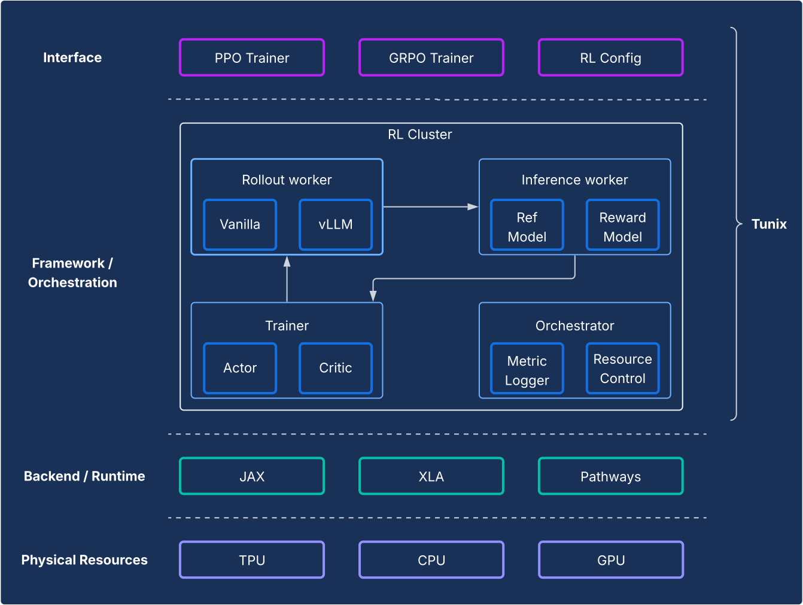
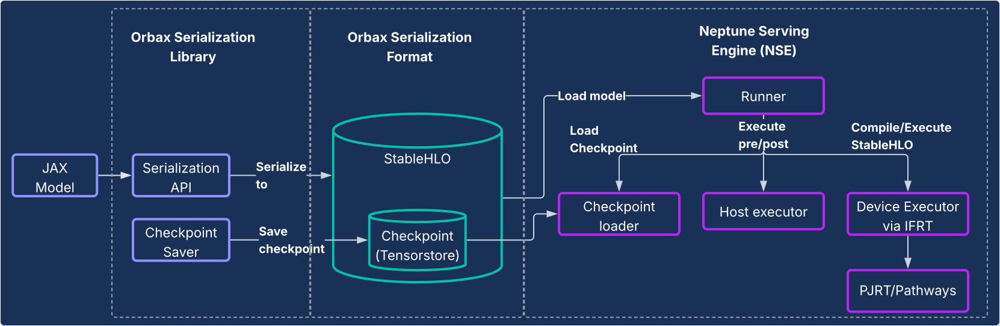

# The Extended JAX Ecosystem

Beyond the core stack, a rich ecosystem of specialized libraries provides the infrastructure, advanced tools, and application-layer solutions needed for end-to-end ML development.

## Foundational Infrastructure: Compilers and Runtimes

(xla-section)=
### XLA: The Hardware-Agnostic, Compiler-Centric Engine

#### Motivation

[XLA](https://openxla.org/xla) or Accelerated Linear Algebra is our domain specific compiler, which is well integrated into JAX and supports TPU, CPU and GPU hardware devices.  From inception, XLA has been designed to be  a hardware agnostic code generator targeting TPUs, GPUs, and CPUs.

Our compiler-first design is a fundamental architectural choice that creates a durable advantage in a rapidly evolving research landscape. In contrast, the prevailing kernel-centric approach in other ecosystems relies on hand-optimized libraries for performance. While this is highly effective for stable, well-established model architectures, it creates a bottleneck for innovation. When new research introduces novel architectures, the ecosystem must wait for new kernels to be written and optimized. Our compiler-centric design, however, can often generalize to new patterns, providing a high-performance path for cutting-edge research from day one.

#### Design

XLA works by Just-In-Time (JIT) compiling the computation graphs that JAX generates during its tracing process (e.g., when a function is decorated with `@jax.jit`).

This compilation follows a multi-stage pipeline:

JAX Computation Graph → High-Level Optimizer (HLO) → Low-Level Optimizer (LLO) → Hardware Code

* **From JAX Graph to HLO**: The captured JAX computation graph is converted into XLA's HLO representation. At this high level, powerful, hardware-agnostic optimizations like operator fusion and efficient memory management are applied. The **StableHLO** dialect serves as a durable, versioned interface for this stage.
* **From HLO to LLO:** After high-level optimizations, hardware-specific backends take over, lowering the HLO representation into a machine-oriented LLO.
* **From LLO to Hardware Code:** The LLO is finally compiled into highly-efficient machine code. For TPUs, this code is bundled as **Very Long Instruction Word (VLIW)** packets that are sent directly to the hardware.

For scaling, XLA's design is built around parallelism. It employs algorithms to maximally utilize the matrix multiplication units (MXUs) on a chip. Between chips, XLA uses **SPMD (Single Program Multiple Data)**, a compiler-based parallelization that uses a single program across all devices. This powerful model is exposed through JAX APIs, allowing users to manage data, model, or pipeline parallelism with high-level sharding annotations.

For more complex parallelism patterns, **Multiple Program Multiple Data (MPMD)** is also possible, and libraries like `PartIR:MPMD` allow JAX users to provide MPMD annotations as well.

#### Key strengths

* **Compilation**: just in time compilation of the computation graph allows for optimizations to memory layout, buffer allocation, and memory management. Alternatives such as kernel based methodologies put that burden on the user. In most cases, XLA can achieve excellent performance without compromising developer velocity.
* **Parallelism:** XLA implements several forms of parallelism with SPMD, and this is exposed at the JAX level. This allows for users to express sharding strategies easily, allowing experimentation and scalability of models across thousands of chips.


### Pathways: A Unified Runtime for Massive-Scale Distributed Computation

[Pathways](https://docs.cloud.google.com/ai-hypercomputer/docs/workloads/pathways-on-cloud/pathways-intro) offers abstractions for distributed training and inference with built in fault tolerance and recovery, allowing ML researchers to code as if they are using a single, powerful machine.

#### Motivation

To be able to train and deploy large models, hundreds to thousands of chips are necessary. These chips are spread across numerous racks and host machines. A training job is a large-scale synchronous program that requires all of these chips, and their respective hosts to be working in tandem on XLA computations that have been parallelized (sharded). In the case of large language models, which may need more than tens of thousands of chips, this service must be capable of spanning multiple pods across a data center fabric in addition to using ICI and OCI fabrics within a pod.

#### Design

ML Pathways is the system we use for coordinating distributed computations across hosts and TPU chips. It is designed for scalability and efficiency across hundreds of thousands of accelerators. For large-scale training, it provides a single Python client for multi-slice/multi-pod jobs, [Megascale XLA](https://openxla.org/xprof/megascale_stats) integration, Compilation Service, and Remote Python. It also supports cross-slice parallelism and preemption tolerance, enabling automatic recovery from resource preemptions.

Pathways incorporates optimized cross host collectives which enable XLA computation graphs to further extend beyond a single TPU pod.  It expands XLA's support for data, model, and pipeline parallelism to work across TPU slice boundaries using DCN by means of integrating a distributed runtime that manages DCN communication with XLA communication primitives.

#### Key strengths

* The single-controller architecture, integrated with JAX, is a key abstraction. It allows researchers to explore various sharding and parallelism strategies for training and deployment while scaling to tens of thousands of chips with ease.
* Scaling to tens of thousands of chips with ease, allowing exploration of various sharding and parallelism strategies during model research, training and deployment.


## Advanced Development: Performance, Data, and Efficiency

### Pallas: Writing High-Performance Custom Kernels in JAX

While JAX is compiler first, there are situations where the user would like to exercise fine grained control over the hardware to achieve maximum performance. Pallas is an extension to JAX that enables writing custom kernels for GPU and TPU. It aims to provide precise control over the generated code, combined with the high-level ergonomics of JAX tracing and the `jax.numpy API`.

Pallas exposes a grid-based parallelism model where a user-defined kernel function is launched across a multi-dimensional grid of parallel work-groups. It enables explicit management of the memory hierarchy by allowing the user to define how tensors are tiled and transferred between slower, larger memory (e.g., HBM) and faster, smaller on-chip memory (e.g., VMEM on TPU, Shared Memory on GPU), using index maps to associate grid locations with specific data blocks. Pallas can lower the same kernel definition to execute efficiently on both Google's TPUs and various GPUs by compiling kernels into an intermediate representation suitable for the target architecture – Mosaic for TPUs, or utilizing technologies like Triton for the GPU path. With Pallas, users can write high performance kernels that specialize blocks like attention to achieve the best model performance on the target hardware without needing to rely on vendor specific toolkits.

### Tokamax: A Curated Library of State-of-the-Art Kernels

If Pallas is the *tool* for authoring kernels, [Tokamax](https://github.com/openxla/tokamax) is a *library* of state-of-the-art custom accelerator kernels supporting both TPUs and GPUs, built on top of JAX and Pallas enabling users to push their hardware to the maximum. It also provides tooling for users to build and autotune their own custom kernels.

#### Motivation

JAX, with its roots in XLA, is a compiler-first framework, however a narrow set of cases exists where the user needs to take direct control of the hardware to achieve maximum performance[^7]. Custom kernels are critical to squeezing out every last ounce of performance from expensive ML accelerator resources such as TPUs and GPUs. While they are widely employed to enable performant execution of key operators such as Attention, implementing them requires a deep understanding of both the model and the target hardware (micro)architecture. Tokamax provides one authoritative source of curated, well-tested, high-performance kernels, in conjunction with robust shared infrastructure for their development, maintenance, and lifecycle management. Such a library can also act as a reference implementation for users to build on and customize as necessary. This allows users to focus on their modeling efforts without needing to worry about infrastructure.

#### Design

For any given kernel, Tokamax provides a common API that may be backed by multiple implementations. For example, TPU kernels may be implemented either by standard XLA lowering, or explicitly via Pallas/Mosaic-TPU. GPU kernels may be implemented by standard XLA lowering, via Mosaic-GPU, or Triton. By default, it picks the best-known implementation for a given configuration, determined by cached results from periodic autotuning and benchmarking runs, though users may choose specific implementations if desired. New implementations may be added over time to better exploit specific features in new hardware generations for even better performance.

A key component of the library, beyond the kernels themselves, is the supporting infrastructure that will help power users choosing to write their own custom kernels. For example, the autotuning infrastructure lets the user define a set of configurable parameters (e.g., tile sizes) that Tokamax can perform an exhaustive sweep on, to determine and cache the best possible tuned settings. Nightly regressions protect users from unexpected performance and numerics issues caused by changes to underlying compiler infrastructure or other dependencies.

#### Key Strengths

* **Seamless developer experience:** A unified, curated, library will provide known-good high-performance implementations of key kernels, with clear expressions of supported hardware generations and expected performance, both programmatically and in documentation. This minimizes fragmentation and churn.
* **Flexibility and lifecycle management:** Users may choose different implementations as desired, even changing them over time if appropriate. For example, if the XLA compiler enhances support for certain operations obviating the need for custom kernels, there is a simple path to deprecation and migration.
* **Extensibility:** Users may implement their own kernels, while leveraging well-supported shared infrastructure, allowing them to focus on their value added capabilities and optimizations. Clearly authored standard implementations serve as a starting point for users to learn from and extend.


### Qwix: Non-Intrusive, Comprehensive Quantization

Qwix is a comprehensive quantization library for the JAX ecosystem, supporting both LLMs and other model types across all stages, including training (QAT, QT, QLoRA) and inference (PTQ), targeting both XLA and on-device runtimes.

#### Motivation

Existing quantization libraries, particularly in the PyTorch ecosystem, often serve limited purposes (e.g., only PTQ or only QLoRA). This fragmented landscape forces users to switch tools, impeding consistent code usage and precise numerical matching between training and inference. Furthermore, many solutions require substantial model modifications, tightly coupling the model logic to the quantization logic.

#### Design

Qwix's design philosophy emphasizes a comprehensive solution and, critically, **non-intrusive model integration**. It is architected with a hierarchical, extensible design built on reusable functional APIs.

This non-intrusive integration is achieved through a meticulously designed **interception mechanism** that redirects JAX functions to their quantized counterparts. This allows users to integrate their models without any modifications, completely decoupling quantization code from model definitions.

The following example demonstrates applying `w4a4` (4-bit weight, 4-bit activation) quantization to an LLM's MLP layers and `w8` (8-bit weight) quantization to the embedder. To change the quantization recipe, only the rules list needs to be updated.

```py
fp_model = ModelWithoutQuantization(...)
rules = [
    qwix.QuantizationRule(
        module_path=r'embedder',
        weight_qtype='int8',
    ),
    qwix.QuantizationRule(
        module_path=r'layers_\d+/mlp',
        weight_qtype='int4',
        act_qtype='int4',
        tile_size=128,
        weight_calibration_method='rms,7',
    ),
]
quantized_model = qwix.quantize_model(fp_model, qwix.PtqProvider(rules))
```

#### Key Strengths

* **Comprehensive Solution:** Qwix is broadly applicable across numerous quantization scenarios, ensuring consistent code usage between training and inference.
* **Non-Intrusive Model Integration:** As the example shows, users can integrate models with a single line of code, without modification. This allows developers to easily sweep hyperparameters over many quantization schemes to find the best quality/performance tradeoff.
* **Federated with Other Libraries:** Qwix seamlessly integrates with the JAX AI stack. For example, Tokamax automatically adapts to use quantized versions of kernels, without additional user code, when the model is quantized with Qwix.
* **Research Friendly:** Qwix's foundational APIs and extensible architecture empower researchers to explore new algorithms and facilitate straightforward comparisons with integrated benchmark and evaluation tools.


## The Application Layer: Training and Alignment

(foundational-model-maxtext-and)=
### Foundation Model Training: MaxText and MaxDiffusion

[MaxText](https://maxtext.readthedocs.io/en/latest/) and [MaxDiffusion](https://github.com/AI-Hypercomputer/maxdiffusion) are Google’s flagship LLM and Diffusion model training frameworks, respectively. With a large selection of highly optimized implementations of popular open-weights models, these repositories serve a dual purpose: they function as both a ready-to-go model training codebase and as a reference that foundation model builders can use to build upon.

#### Motivation

There is rapid growth of interest across the industry in training GenAI models. The popularity of open models has accelerated this trend, providing users with proven architectures. To train and adapt these models, users require high performance, efficiency, scalability to extreme numbers of chips, and clear, understandable code. They need a framework that can adapt to new techniques and target both TPUs and GPUs. [MaxText](https://maxtext.readthedocs.io/en/latest/) and MaxDiffusion are comprehensive solutions designed to fulfill these needs.

#### Design

[MaxText](https://maxtext.readthedocs.io/en/latest/) and MaxDiffusion are foundation model codebases designed with readability and performance in mind. They are structured with well-tested, reusable components: model definitions that leverage custom kernels (like Tokamax) for maximum performance, a training harness for orchestration and monitoring, and a powerful config system that allows users to control details like sharding and quantization (via Qwix) through an intuitive interface. Advanced reliability features like multi-tier checkpointing are incorporated to ensure sustained goodput.

They leverage the best-in-class JAX libraries—Qwix, [Tunix](https://tunix.readthedocs.io/en/latest/), [Orbax](https://orbax.readthedocs.io/en/latest/index.html), and [Optax](https://optax.readthedocs.io/en/latest/)—to deliver core capabilities. This allows them to provide robust, scalable infrastructure, reducing development overhead and allowing users to focus on the modeling task. For inference, the model code is shared to enable efficient and scalable serving.

#### Key Strengths

* **Performant by Design:** With training infrastructure set up for high "goodput" (useful throughput) and model implementations optimized for high MFU (Model Flops Utilization), [MaxText](#foundational-model-maxtext-and) and MaxDiffusion deliver high performance at scale out of the box
* **Built for Scale:** Leveraging the power of the JAX AI stack (especially Pathways), these frameworks allow users to scale seamlessly from tens of chips to tens of thousands of chips
* **Solid Base for Foundation Model Builders:** The high-quality, readable implementations serve as a solid starting point for builders to either use as an end-to-end solution or as a reference implementation for their own customizations


### Post-Training and Alignment: The Tunix Framework

[Tunix](https://tunix.readthedocs.io/en/latest/) offers state-of-the-art open-source reinforcement learning (RL) algorithms, along with a robust framework and infrastructure, providing a streamlined path for users to experiment with LLM post-training techniques (including Supervised Fine-Tuning (SFT) and alignment) using JAX and TPUs.

#### Motivation

Post-training is the critical step in unlocking the true power of LLMs. The Reinforcement Learning stage is particularly crucial for developing alignment and reasoning capabilities. While fast-moving open-source development in this area has been prolific, it has been almost exclusively based on PyTorch and GPUs, leaving a fundamental gap for JAX and TPU solutions. [Tunix](https://tunix.readthedocs.io/en/latest/) (Tune-in-JAX) is a high-performance, JAX-native library designed to fill this gap.

#### Design



From a framework perspective, [Tunix](https://tunix.readthedocs.io/en/latest/) enables a state-of-the-art setup that **clearly separates RL algorithms from the infrastructure**. It offers a lightweight, client-like API that hides the complexity of the RL infrastructure, allowing users to develop new algorithms easily. [Tunix](https://tunix.readthedocs.io/en/latest/) provides out-of-the-box solutions for popular algorithms, including PPO, DPO, and others.

On the infrastructure side, [Tunix](https://tunix.readthedocs.io/en/latest/) has native integration with Pathways, enabling a single-controller architecture that makes multi-node RL training easily accessible. On the trainer side, [Tunix](https://tunix.readthedocs.io/en/latest/) natively supports parameter-efficient training (e.g., LoRA) and leverages JAX sharding and XLA (GSPMD) to generate a performant compute graph. It supports popular open-source models like Gemma and Llama out of the box.

#### Key Strengths

* **Simplicity:** It provides a high-level, client-like API that abstracts away the complexities of the underlying distributed infrastructure.
* **Developer Efficiency:** Tunix accelerates the R\&D lifecycle with out-of-the-box algorithms and pre-built "recipes," enabling users to get a working model and iterate quickly.
* **Performance and Scalability:** Tunix enables a highly efficient and horizontally scalable training infrastructure by leveraging Pathways as a single controller on the backend.


## The Application Layer: Production and Inference

A historical challenge for JAX adoption has been the path from research to production. The JAX AI stack now provides a mature, two-pronged production story that offers both ecosystem compatibility and native JAX performance.

### High-Performance LLM Inference: The vLLM-TPU Solutions

vLLM-TPU is Google's high-performance inference stack designed to run PyTorch and JAX native Large Language Models (LLMs) efficiently on Cloud TPUs. It achieves this by natively integrating the popular open-source vLLM framework with Google's JAX and TPU ecosystem.

#### Motivation

The industry is rapidly evolving, with growing demand for seamless, high-performing, and easy-to-use inference solutions. Users often face significant challenges from complex and inconsistent tooling, subpar performance, and limited model compatibility. The vLLM-TPU stack addresses these issues by providing a unified, performant, and intuitive platform.

#### Design

This solution pragmatically extends the vLLM framework, rather than reinventing it. vLLM-TPU is a highly optimized open-source LLM serving engine known for its high throughput, achieved via key features like **`PagedAttention`** (which manages KV caches like virtual memory to minimize fragmentation) and **`Continuous Batching`** (which dynamically adds requests to the batch to improve utilization).

vLLM-TPU builds on this foundation and develops core components for request handling, scheduling, and memory management. It introduces a **JAX-based backend** that acts as a bridge, translating vLLM's computational graph and memory operations into TPU-executable code. This backend handles device interactions, JAX model execution, and the specifics of managing the KV cache on TPU hardware. It incorporates TPU-specific optimizations, such as efficient attention mechanisms (e.g., leveraging JAX Pallas kernels for Ragged Paged Attention) and quantization, all tailored for the TPU architecture.

#### Key Strengths

* **Zero Onboarding/Offboarding Cost for Users:** Users can adopt this solution without significant friction. From a user-experience perspective, processing inference requests is identical to on GPUs. The CLI to start the server, accept prompts, and return outputs are all shared.
* **Fully Embrace the Ecosystem:** This approach utilizes and contributes to the vLLM interface and user experience, ensuring compatibility and ease of use.
* **Fungibility between TPUs and GPUs:** The solution works efficiently on both TPUs and GPUs, allowing users flexibility.
* **Cost Efficient (Best Perf/$):** Optimizes performance to provide the best performance-to-cost ratio for popular models.


### JAX-Native Serving: Orbax Serialization and Neptune Serving Engine

For models other than LLMs, or for users desiring a fully JAX-native pipeline, the Orbax serialization library and Neptune serving engine (NSE) system provide an end-to-end, high-performance serving solution.

#### Motivation

Historically, JAX models often relied on a circuitous path to production, such as being wrapped in TensorFlow graphs and deployed using TensorFlow serving. This approach introduced significant limitations and inefficiencies, forcing developers to engage with a separate ecosystem and slowing down iteration. A dedicated JAX-native serving system is crucial for sustainability, reduced complexity, and optimized performance.

#### Design

This solution consists of two core components, as illustrated in the diagram below.




1. **Orbax Serialization Library:** Provides user-friendly APIs for serializing JAX models into a new, robust Orbax serialization format. This format is optimized for production deployment. Its core includes: (a) directly representing JAX model computations using **StableHLO**, allowing the computation graph to be represented natively, and (b) leveraging **TensorStore** for storing weights, enabling fast checkpoint loading for serving.
2. **Neptune Serving Engine (NSE):** This is the accompanying high-performance, flexible serving engine (typically deployed as a C++ binary) designed to natively run JAX models in the Orbax format. NSE offers production-essential capabilities, such as fast model loading, high-throughput concurrent serving with built-in batching, support for multiple model versions, and both single- and multi-host serving (leveraging PJRT and Pathways).

#### Key Strengths

* **JAX Native Serving:** The solution is built natively for JAX, eliminating inter-framework overhead in model serialization and serving. This ensures lightning-fast model loading and optimized execution across CPUs, GPUs, and TPUs.
* **Effortless Production Deployment:** Serialized models provide a **hermetic deployment path** that is unaffected by drift in Python dependencies and enables runtime model integrity checks. This provides a seamless, intuitive path for JAX model productionization.
* **Enhanced Developer Experience:** By eliminating the need for cumbersome framework wrapping, this solution significantly reduces dependencies and system complexity, speeding up iteration for JAX developers.

## System-Wide Analysis and Profiling

### XProf: Deep, Hardware-Integrated Performance Profiling

[XProf](https://openxla.org/xprof) is a profiling and performance analysis tool that provides in-depth visibility into various aspects of ML workload execution, enabling users to debug and optimize performance. It is deeply integrated into both the JAX and TPU ecosystems.

#### Motivation

On one hand, ML workloads are growing ever more complicated. On the other, there is an explosion of specialized hardware capabilities targeting these workloads. Matching the two effectively to ensure peak performance and efficiency is critical, given the enormous costs of ML infrastructure. This requires deep visibility into both the workload and the hardware, presented in a way that is easily consumable. XProf excels at this.

#### Design

XProf consists of two primary components: collection and analysis.

1. **Collection:** XProf captures information from various sources: annotations in the user’s JAX code, cost models for operations within the XLA compiler, and **purpose-built hardware profiling features within the TPU**. This collection can be triggered programmatically or on-demand, generating a comprehensive event artifact.
2. **Analysis:** XProf post-processes the collected data and creates a suite of powerful visualizations, accessed via a browser.

#### Key Strengths

The true power of XProf comes from its deep integration with the full stack, providing a breadth and depth of analysis that is a tangible benefit of the co-designed JAX/TPU ecosystem.

* **Co-designed with the TPU:** XProf exploits hardware features specifically designed for seamless profile collection, enabling a collection overhead of **less than 1%**. This allows profiling to be a lightweight, iterative part of development.
* **Breadth and Depth of Analysis:** XProf yields deep analysis across multiple axes. Its tools include:
  * **Trace Viewer:** An op-by-op timeline view of execution on different hardware units (e.g., TensorCore).
  * **HLO Op Profile:** Breaks down the total time spent into different categories of operations.
  * **Memory Viewer:** Details memory allocations by different ops during the profiled window.
  * **Roofline Analysis:** Helps identify whether specific ops are compute- or memory-bound and how far they are from the hardware’s peak capabilities.
  * **Graph Viewer:** Provides a view into the full HLO graph executed by the hardware.


[^7]:  This is a well established paradigm and has precedent in the CPU world, where compiled code forms the bulk of the program with developers dropping down to intrinsics or inline assembly to optimize performance critical sections.
