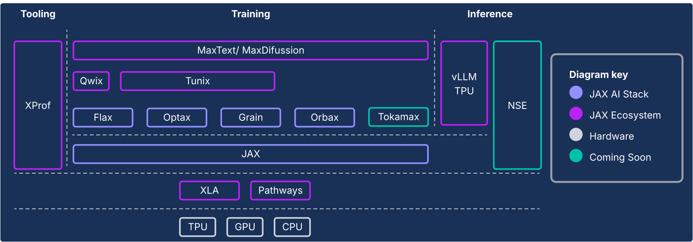

# A Modular, Compiler-First Architecture for Modern AI

The [JAX AI stack](https://jaxstack.ai/) extends the JAX numerical core with a collection of Google-backed composable libraries, evolving it into a robust, end-to-end, open-source platform for Machine Learning at extreme scales. As such, the JAX AI stack consists of a comprehensive and robust ecosystem that addresses the entire ML lifecycle:

* **Industrial-Scale Foundation:** The stack is architected for massive scale, leveraging ML Pathways for orchestrating training across tens of thousands of chips and [Orbax](https://orbax.readthedocs.io/en/latest/index.html) for resilient, high-throughput asynchronous checkpointing, enabling production-grade training of state-of-the-art models.
* **Complete, Production-Ready Toolkit:** It provides a comprehensive set of libraries for the entire development process: Flax for flexible model authoring and "surgery," [Optax](https://optax.readthedocs.io/en/latest/) for composable optimization strategies, and [Grain](https://google-grain.readthedocs.io/en/latest/) for the deterministic data pipelines essential for reproducible large-scale runs.
* **Peak, Specialized Performance:** To achieve maximum hardware utilization, the stack offers specialized libraries including Tokamax for state-of-the-art custom kernels, Qwix for non-intrusive quantization that boosts training and inference speed, and XProf for deep, hardware-integrated performance profiling.
* **Full Path to Production:** The stack provides a seamless transition from research to deployment. This includes [MaxText](https://maxtext.readthedocs.io/en/latest/) as a scalable reference for foundation model training, [Tunix](https://tunix.readthedocs.io/en/latest/) for state-of-the-art reinforcement learning (RL) and alignment, and a unified inference solution via vLLM-TPU integration and the native JAX Serving runtime.

The JAX ecosystem philosophy is one of loosely coupled components, each of which does one thing well. Rather than being a monolithic ML framework, JAX itself is narrowly-scoped and focuses on efficient array operations and program transformations. The ecosystem is built upon this core framework to provide a wide array of functionalities, related to both the training of ML models and other types of workloads such as scientific computing.

This system of loosely coupled components hands freedom of choice back to users, enabling them to select and combine libraries in the best way to suit their requirements. From a software engineering perspective, this architecture also allows parts that would traditionally be considered core framework components (for example data pipelines, checkpointing, etc.) to be iterated upon rapidly without the risk of destabilizing the core framework or being caught up in release cycles. Given that most functionality is brought in using libraries rather than via changes to a monolithic framework, it makes the core numerics library more durable and adaptable to future shifts in the technology landscape.

The following sections provide a technical overview of the JAX ecosystem, its key features, the design decisions behind them, and how they combine to build a durable platform for modern ML workloads.

| Component | Function / Description |
| ----- | ----- |
| **JAX AI stack core and components**[^1] |  |
| [**JAX**](https://docs.jax.dev/en/latest/) | Accelerator-oriented array computation and program transformation (JIT, grad, vmap, pmap). |
| [**Flax**](https://flax.readthedocs.io/en/stable/) | Flexible neural network authoring library for intuitive model creation and "surgery." |
| [**Optax**](https://optax.readthedocs.io/en/latest/) | A library of composable gradient processing and optimization transformations. |
| [**Orbax**](https://orbax.readthedocs.io/en/latest/) | "Any-scale" distributed checkpointing library for hero-scale training resilience. |
| **JAX Ecosystem \- Infrastructure** |  |
| [**XLA**](https://openxla.org/) | Distributed runtime for orchestrating computation across tens of thousands of chips. |
| [**Pathways**](https://docs.cloud.google.com/ai-hypercomputer/docs/workloads/pathways-on-cloud/pathways-intro) | A JAX extension for writing low-level, high-performance custom kernels in Python. |
| **JAX Ecosystem \- Adv. Development** |  |
| [**Pallas**](https://docs.jax.dev/en/latest/pallas/index.html) | A JAX extension for writing low-level, high-performance custom kernels in Python. |
| [**Tokamax**](https://github.com/openxla/tokamax) | A curated library of state-of-the-art, high-performance custom kernels (e.g., Attention). |
| [**Qwix**](https://github.com/google/qwix) | A comprehensive, non-intrusive library for quantization (PTQ, QAT, QLoRA). |
| [**Grain**](https://google-grain.readthedocs.io/en/latest/) | A scalable, deterministic, and checkpointable input data pipeline library. |
| **JAX Ecosystem \- Application** |  |
| [**MaxText** / **MaxDiffusion**](https://maxtext.readthedocs.io/en/latest/) | Flagship, scalable reference frameworks for training foundation models (LLM, Diffusion). |
| [**Tunix**](https://tunix.readthedocs.io/en/latest/index.html) | A framework for state-of-the-art post-training and alignment (RLHF, DPO). |
| [**vLLM-TPU**](https://docs.vllm.ai/projects/tpu/en/latest/) | A high-performance LLM inference solution via native integration of the vLLM framework. |
| **Neptune Serving Engine** (coming soon) | JAX Serving Runtime: a high-performance, JAX-native C++ server for non-LLM models. |
| [**XProf**](https://openxla.org/xprof) | A deep, hardware-integrated profiler for system-wide performance analysis. |

**Table 1: The JAX AI Stack and other Ecosystem Components**

[^1]: The core components are included in the [`jax-ai-stack` Python package](https://docs.jaxstack.ai/en/latest/install.html).

**Figure 1: The JAX AI Stack and Ecosystem Components**

